# 🏗️ Arquitetura do Sistema — IRPF Document Processor

**Versão:** 2.1  
**Autor:** Arquitetura de Software  
**Data:** 2026-01-16  
**Status:** Implementação em andamento (55% completo)

---

## 1. Visão Geral

O **IRPF Processor** é uma plataforma backend event-driven para ingestão, extração e consulta de dados de Declarações de Imposto de Renda Pessoa Física (IRPF). A arquitetura foi desenhada seguindo princípios de:

- **Event-Driven Architecture (EDA)** — Comunicação assíncrona via eventos
- **CQRS simplificado** — Separação entre escrita (workers) e leitura (APIs)
- **Document-Centric** — MongoDB como store principal
- **Async First** — Processamento não-bloqueante
- **Smart Extraction** — Detecção automática de PDF digital vs imagem com OCR
- **Version-Aware Parsing** — Templates YAML para diferentes anos-exercício

---

## 1.1 Status de Implementação

| Componente | Status | Descrição |
|------------|--------|-----------|
| **Infraestrutura** | ✅ Completo | Docker Compose, MongoDB, Redis, MinIO |
| **Domain Layer** | ✅ Completo | Entities, Value Objects, Exceptions |
| **Templates System** | ✅ Completo | YAML templates (2023, 2024, 2025) |
| **IRPF Parser** | ✅ Completo | 10 extratores de seção |
| **Version Detector** | ✅ Completo | Detecção automática de ano-exercício |
| **Test Generator** | ✅ Completo | 9 perfis de declaração |
| **API Endpoints** | ⏳ Parcial | Health OK, Documents em progresso |
| **Workers** | ⏳ Estrutura | Broker configurado, actors pendentes |
| **SSE Events** | ⏳ Pendente | Interface definida |

---

## 2. Diagrama de Contexto (C4 — Level 1)

Visão de alto nível mostrando o sistema e suas interações externas.

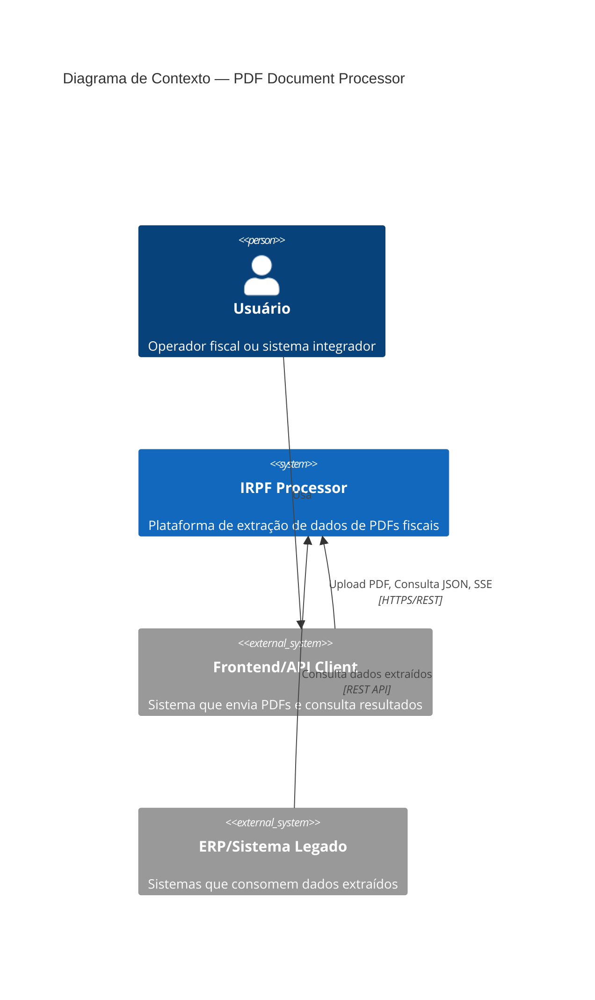
```mermaid
C4Context
    title Diagrama de Contexto — PDF Document Processor

    Person(user, "Usuário", "Operador fiscal ou sistema integrador")
    
    System(irpf_processor, "IRPF Processor", "Plataforma de extração de dados de PDFs fiscais")
    
    System_Ext(frontend, "Frontend/API Client", "Sistema que envia PDFs e consulta resultados")
    System_Ext(erp, "ERP/Sistema Legado", "Sistemas que consomem dados extraídos")
    
    Rel(user, frontend, "Usa")
    Rel(frontend, irpf_processor, "Upload PDF, Consulta JSON, SSE", "HTTPS/REST")
    Rel(erp, irpf_processor, "Consulta dados extraídos", "REST API")
    
    UpdateLayoutConfig($c4ShapeInRow="3", $c4BoundaryInRow="1")
```

---

## 3. Diagrama de Containers (C4 — Level 2)

Componentes técnicos e suas responsabilidades.

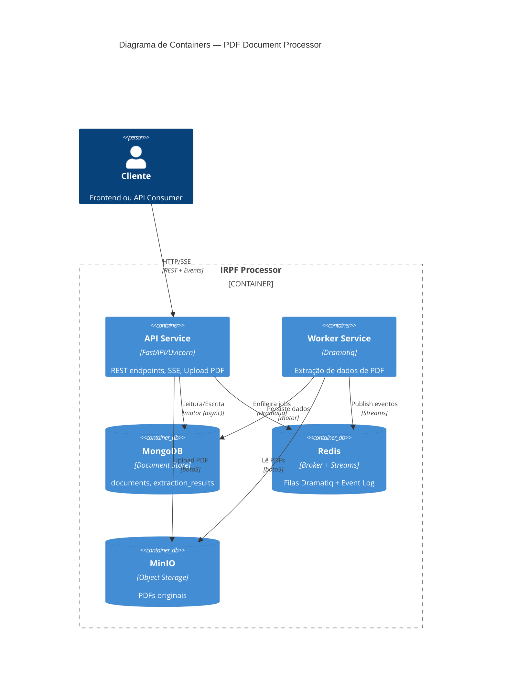
```mermaid
C4Container
    title Diagrama de Containers — PDF Document Processor

    Person(client, "Cliente", "Frontend ou API Consumer")

    Container_Boundary(system, "IRPF Processor") {
        Container(api, "API Service", "FastAPI/Uvicorn", "REST endpoints, SSE, Upload PDF")
        Container(workers, "Worker Service", "Dramatiq", "Extração de dados de PDF")
        
        ContainerDb(mongo, "MongoDB", "Document Store", "documents, extraction_results")
        ContainerDb(redis, "Redis", "Broker + Streams", "Filas Dramatiq + Event Log")
        ContainerDb(minio, "MinIO", "Object Storage", "PDFs originais")
    }

    Rel(client, api, "HTTP/SSE", "REST + Events")
    Rel(api, mongo, "Leitura/Escrita", "motor (async)")
    Rel(api, redis, "Publish eventos", "redis-py")
    Rel(api, minio, "Upload PDF", "boto3")
    Rel(api, redis, "Enfileira jobs", "Dramatiq")
    
    Rel(workers, redis, "Consome jobs", "Dramatiq")
    Rel(workers, mongo, "Persiste dados", "motor")
    Rel(workers, minio, "Lê PDFs", "boto3")
    Rel(workers, redis, "Publish eventos", "Streams")

    UpdateLayoutConfig($c4ShapeInRow="3", $c4BoundaryInRow="1")
```

---

## 4. Arquitetura de Componentes

Visão detalhada dos módulos internos.

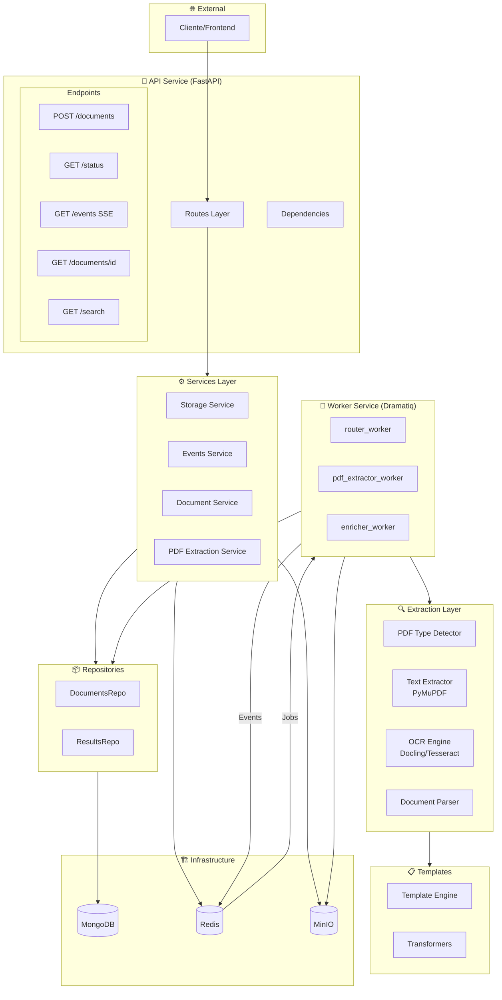
```mermaid
flowchart TB
    subgraph External["🌐 External"]
        CLIENT[Cliente/Frontend]
    end

    subgraph API["📡 API Service (FastAPI)"]
        direction TB
        ROUTES[Routes Layer]
        DEPS[Dependencies]
        
        subgraph Routes["Endpoints"]
            R_UPLOAD[POST /documents]
            R_STATUS[GET /status]
            R_SSE[GET /events SSE]
            R_RESULT[GET /documents/id]
            R_SEARCH[GET /search]
        end
    end

    subgraph Services["⚙️ Services Layer"]
        SVC_STORAGE[Storage Service]
        SVC_EVENTS[Events Service]
        SVC_DOCUMENT[Document Service]
        SVC_EXTRACTION[PDF Extraction Service]
    end

    subgraph Workers["👷 Worker Service (Dramatiq)"]
        W_ROUTER[router_worker]
        W_EXTRACTOR[pdf_extractor_worker]
        W_ENRICHER[enricher_worker]
    end

    subgraph Extraction["🔍 Extraction Layer"]
        E_DETECTOR[PDF Type Detector]
        E_TEXT[Text Extractor<br/>PyMuPDF]
        E_OCR[OCR Engine<br/>Docling/Tesseract]
        E_PARSER[Document Parser]
    end

    subgraph Templates["📋 Templates"]
        T_ENGINE[Template Engine]
        T_TRANSFORM[Transformers]
    end

    subgraph Repositories["📦 Repositories"]
        REPO_DOC[DocumentsRepo]
        REPO_RESULTS[ResultsRepo]
    end

    subgraph Infrastructure["🏗️ Infrastructure"]
        MONGO[(MongoDB)]
        REDIS[(Redis)]
        MINIO[(MinIO)]
    end

    CLIENT --> ROUTES
    ROUTES --> Services
    Services --> Repositories
    Services --> REDIS
    Services --> MINIO
    Repositories --> MONGO
    
    REDIS -->|Jobs| Workers
    Workers --> Extraction
    Extraction --> Templates
    Workers --> Repositories
    Workers -->|Events| REDIS
    Workers --> MINIO

    classDef external fill:#f9f,stroke:#333
    classDef api fill:#bbf,stroke:#333
    classDef service fill:#bfb,stroke:#333
    classDef worker fill:#fbf,stroke:#333
    classDef infra fill:#ff9,stroke:#333
```

---

## 5. Diagrama de Classes e Interfaces (DI Pattern)

Estrutura de classes seguindo princípios SOLID com interfaces (Protocols) e Injeção de Dependência.

### 5.1 Visão Geral das Camadas


```mermaid
classDiagram
    direction TB

    %% ============================================
    %% PROTOCOLS (INTERFACES)
    %% ============================================
    
    class IStorageService {
        <<interface>>
        +upload(tenant_id, doc_id, file, media_type) str
        +download(storage_uri) bytes
        +delete(storage_uri) bool
        +exists(storage_uri) bool
    }

    class IEventService {
        <<interface>>
        +publish(document_id, event) None
        +get_events(document_id, after_id) List~Event~
        +stream_events(document_id, after_id) AsyncIterator
    }

    class IDocumentRepository {
        <<interface>>
        +create(document) DocumentModel
        +get_by_id(tenant_id, doc_id) DocumentModel
        +update_status(doc_id, status, **kwargs) bool
        +find_by_sha256(tenant_id, sha256) DocumentModel
    }

    class IResultsRepository {
        <<interface>>
        +create(result) ExtractionResult
        +get_by_document_id(tenant_id, doc_id) ExtractionResult
    }

    class IPdfTypeDetector {
        <<interface>>
        +detect(pdf_bytes) PdfType
        +get_confidence() float
    }

    class IPdfTextExtractor {
        <<interface>>
        +extract(pdf_bytes) ExtractedText
        +get_pages_count() int
    }

    class IOcrEngine {
        <<interface>>
        +extract(pdf_bytes) ExtractedText
        +get_confidence() float
    }

    class IDocumentParser {
        <<interface>>
        +parse(text, pdf_type) DocumentRaw
        +validate(document) ValidationResult
    }

    class ITemplateEngine {
        <<interface>>
        +render(document_raw, template_id) dict
        +register_template(template) None
    }

    %% ============================================
    %% IMPLEMENTATIONS
    %% ============================================

    class MinioStorageService {
        -client: S3Client
        -bucket: str
        +upload(tenant_id, doc_id, file, media_type) str
        +download(storage_uri) bytes
        +delete(storage_uri) bool
        +exists(storage_uri) bool
    }

    class RedisEventService {
        -redis: Redis
        -max_len: int
        +publish(document_id, event) None
        +get_events(document_id, after_id) List~Event~
        +stream_events(document_id, after_id) AsyncIterator
    }

    class MongoDocumentRepository {
        -db: AsyncIOMotorDatabase
        -collection: str
        +create(document) DocumentModel
        +get_by_id(tenant_id, doc_id) DocumentModel
        +update_status(doc_id, status, **kwargs) bool
        +find_by_sha256(tenant_id, sha256) DocumentModel
    }

    class MongoResultsRepository {
        -db: AsyncIOMotorDatabase
        -collection: str
        +create(result) ExtractionResult
        +get_by_document_id(tenant_id, doc_id) ExtractionResult
    }

    class MagicBytesDetector {
        +detect(pdf_bytes) PdfType
        +get_confidence() float
        -check_text_layer(pdf) bool
    }

    class PyMuPdfExtractor {
        +extract(pdf_bytes) ExtractedText
        +get_pages_count() int
        -extract_text_blocks(page) List
    }

    class DoclingOcrEngine {
        +extract(pdf_bytes) ExtractedText
        +get_confidence() float
        -preprocess_image(page) Image
    }

    class TesseractOcrEngine {
        +extract(pdf_bytes) ExtractedText
        +get_confidence() float
        -pdf_to_images(pdf) List~Image~
    }

    class IRPFParser {
        -template_registry: ITemplateRegistry
        -extractors: List~ISectionExtractor~
        +parse(pdf_path) IRPFDeclarationResult
        +detect_version(text) str
        -run_extractors(context) None
        -calculate_confidence(result) float
    }

    class JinjaTemplateEngine {
        -templates: dict
        -transformers: dict
        +render(document_raw, template_id) dict
        +register_template(template) None
    }

    %% ============================================
    %% INTERFACE IMPLEMENTATIONS
    %% ============================================

    IStorageService <|.. MinioStorageService
    IEventService <|.. RedisEventService
    IDocumentRepository <|.. MongoDocumentRepository
    IResultsRepository <|.. MongoResultsRepository
    IPdfTypeDetector <|.. MagicBytesDetector
    IPdfTextExtractor <|.. PyMuPdfExtractor
    IOcrEngine <|.. DoclingOcrEngine
    IOcrEngine <|.. TesseractOcrEngine
    IDocumentParser <|.. DanfeParser
    ITemplateEngine <|.. JinjaTemplateEngine
```

### 5.2 Services Layer (Business Logic)

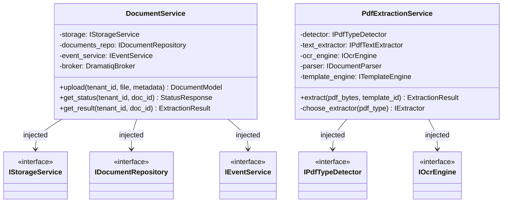
```mermaid
classDiagram
    direction TB

    class DocumentService {
        -storage: IStorageService
        -documents_repo: IDocumentRepository
        -event_service: IEventService
        -broker: DramatiqBroker
        +upload(tenant_id, file, metadata) DocumentModel
        +get_status(tenant_id, doc_id) StatusResponse
        +get_result(tenant_id, doc_id) ExtractionResult
    }

    class PdfExtractionService {
        -detector: IPdfTypeDetector
        -text_extractor: IPdfTextExtractor
        -ocr_engine: IOcrEngine
        -parser: IDocumentParser
        -template_engine: ITemplateEngine
        +extract(pdf_bytes, template_id) ExtractionResult
        -choose_extractor(pdf_type) IExtractor
    }

    class IStorageService {
        <<interface>>
    }
    class IDocumentRepository {
        <<interface>>
    }
    class IEventService {
        <<interface>>
    }
    class IPdfTypeDetector {
        <<interface>>
    }
    class IOcrEngine {
        <<interface>>
    }

    DocumentService --> IStorageService : injected
    DocumentService --> IDocumentRepository : injected
    DocumentService --> IEventService : injected
    PdfExtractionService --> IPdfTypeDetector : injected
    PdfExtractionService --> IOcrEngine : injected
```

### 5.3 Workers (Dramatiq Actors)

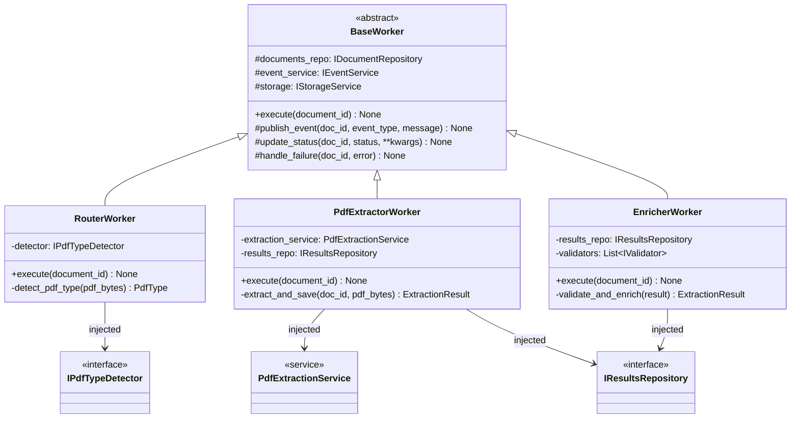
```mermaid
classDiagram
    direction TB

    class BaseWorker {
        <<abstract>>
        #documents_repo: IDocumentRepository
        #event_service: IEventService
        #storage: IStorageService
        +execute(document_id) None
        #publish_event(doc_id, event_type, message) None
        #update_status(doc_id, status, **kwargs) None
        #handle_failure(doc_id, error) None
    }

    class RouterWorker {
        -detector: IPdfTypeDetector
        +execute(document_id) None
        -detect_pdf_type(pdf_bytes) PdfType
    }

    class PdfExtractorWorker {
        -extraction_service: PdfExtractionService
        -results_repo: IResultsRepository
        +execute(document_id) None
        -extract_and_save(doc_id, pdf_bytes) ExtractionResult
    }

    class EnricherWorker {
        -results_repo: IResultsRepository
        -validators: List~IValidator~
        +execute(document_id) None
        -validate_and_enrich(result) ExtractionResult
    }

    BaseWorker <|-- RouterWorker
    BaseWorker <|-- PdfExtractorWorker
    BaseWorker <|-- EnricherWorker

    class IPdfTypeDetector {
        <<interface>>
    }
    class PdfExtractionService {
        <<service>>
    }
    class IResultsRepository {
        <<interface>>
    }

    RouterWorker --> IPdfTypeDetector : injected
    PdfExtractorWorker --> PdfExtractionService : injected
    PdfExtractorWorker --> IResultsRepository : injected
    EnricherWorker --> IResultsRepository : injected
```

### 5.4 Schemas (Pydantic Models)

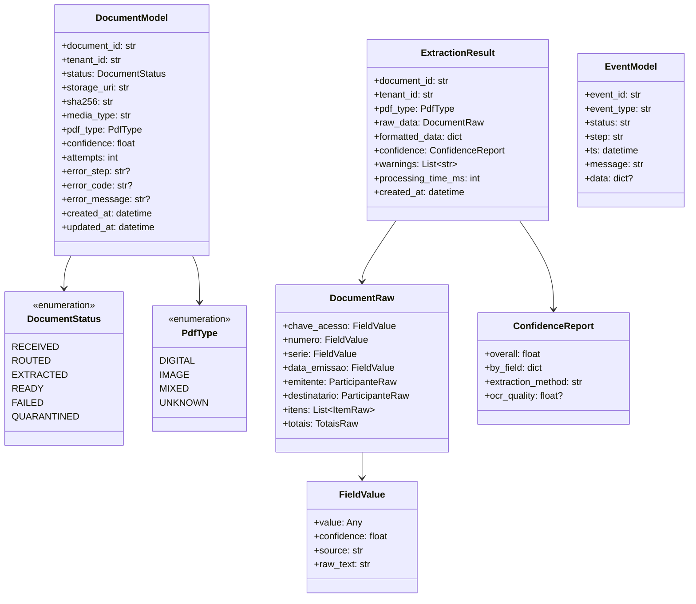
```mermaid
classDiagram
    direction TB

    class DocumentModel {
        +document_id: str
        +tenant_id: str
        +status: DocumentStatus
        +storage_uri: str
        +sha256: str
        +media_type: str
        +pdf_type: PdfType
        +confidence: float
        +attempts: int
        +error_step: str?
        +error_code: str?
        +error_message: str?
        +created_at: datetime
        +updated_at: datetime
    }

    class DocumentStatus {
        <<enumeration>>
        RECEIVED
        ROUTED
        EXTRACTED
        READY
        FAILED
        QUARANTINED
    }

    class PdfType {
        <<enumeration>>
        DIGITAL
        IMAGE
        MIXED
        UNKNOWN
    }

    class ExtractionResult {
        +document_id: str
        +tenant_id: str
        +pdf_type: PdfType
        +raw_data: DocumentRaw
        +formatted_data: dict
        +confidence: ConfidenceReport
        +warnings: List~str~
        +processing_time_ms: int
        +created_at: datetime
    }

    class DocumentRaw {
        +chave_acesso: FieldValue
        +numero: FieldValue
        +serie: FieldValue
        +data_emissao: FieldValue
        +emitente: ParticipanteRaw
        +destinatario: ParticipanteRaw
        +itens: List~ItemRaw~
        +totais: TotaisRaw
    }

    class FieldValue {
        +value: Any
        +confidence: float
        +source: str
        +raw_text: str
    }

    class ConfidenceReport {
        +overall: float
        +by_field: dict
        +extraction_method: str
        +ocr_quality: float?
    }

    class EventModel {
        +event_id: str
        +event_type: str
        +status: str
        +step: str
        +ts: datetime
        +message: str
        +data: dict?
    }

    DocumentModel --> DocumentStatus
    DocumentModel --> PdfType
    ExtractionResult --> DocumentRaw
    ExtractionResult --> ConfidenceReport
    DocumentRaw --> FieldValue
```

### 5.5 Dependency Injection Container

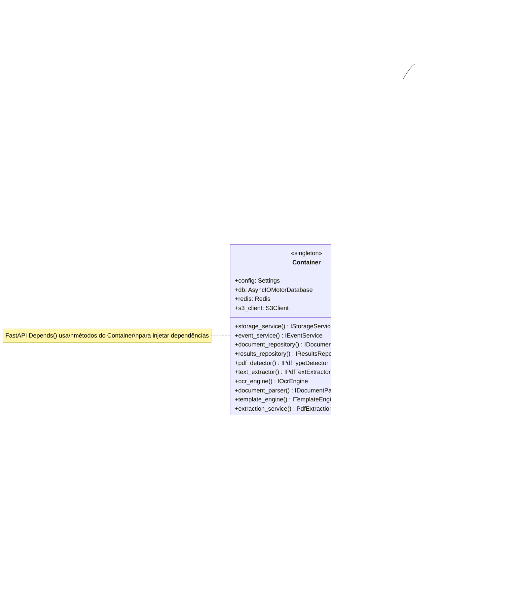
```mermaid
classDiagram
    direction LR

    class Container {
        <<singleton>>
        +config: Settings
        +db: AsyncIOMotorDatabase
        +redis: Redis
        +s3_client: S3Client
        +storage_service() IStorageService
        +event_service() IEventService
        +document_repository() IDocumentRepository
        +results_repository() IResultsRepository
        +pdf_detector() IPdfTypeDetector
        +text_extractor() IPdfTextExtractor
        +ocr_engine() IOcrEngine
        +document_parser() IDocumentParser
        +template_engine() ITemplateEngine
        +extraction_service() PdfExtractionService
        +document_service() DocumentService
    }

    class Settings {
        +mongo_uri: str
        +mongo_db: str
        +redis_url: str
        +minio_endpoint: str
        +minio_access_key: str
        +minio_secret_key: str
        +minio_bucket: str
        +ocr_engine: str
        +default_template: str
    }

    Container --> Settings
    Container ..> IStorageService : provides
    Container ..> IEventService : provides
    Container ..> IDocumentRepository : provides
    Container ..> IResultsRepository : provides
    Container ..> IPdfTypeDetector : provides
    Container ..> IOcrEngine : provides
    Container ..> ITemplateEngine : provides
    Container ..> PdfExtractionService : provides
    Container ..> DocumentService : provides

    note for Container "FastAPI Depends() usa\nmétodos do Container\npara injetar dependências"
```

### 5.6 API Routes e Injeção

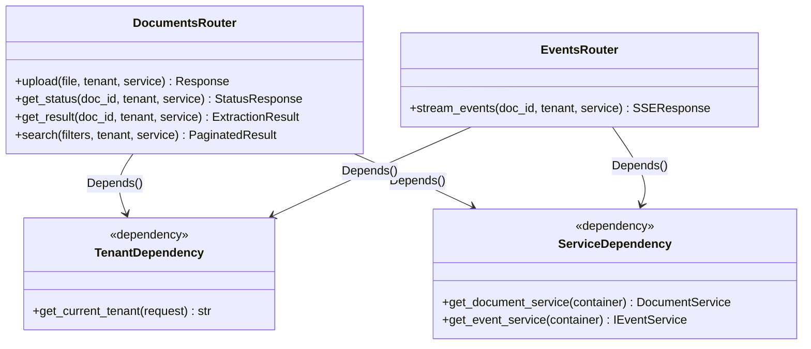
```mermaid
classDiagram
    direction TB

    class DocumentsRouter {
        +upload(file, tenant, service) Response
        +get_status(doc_id, tenant, service) StatusResponse
        +get_result(doc_id, tenant, service) ExtractionResult
        +search(filters, tenant, service) PaginatedResult
    }

    class EventsRouter {
        +stream_events(doc_id, tenant, service) SSEResponse
    }

    class TenantDependency {
        <<dependency>>
        +get_current_tenant(request) str
    }

    class ServiceDependency {
        <<dependency>>
        +get_document_service(container) DocumentService
        +get_event_service(container) IEventService
    }

    DocumentsRouter --> TenantDependency : Depends()
    DocumentsRouter --> ServiceDependency : Depends()
    EventsRouter --> TenantDependency : Depends()
    EventsRouter --> ServiceDependency : Depends()
```

### 5.7 Princípios SOLID Aplicados

| Princípio | Aplicação |
|-----------|-----------|
| **S** - Single Responsibility | Cada classe tem uma única responsabilidade (Detector só detecta, Extractor só extrai, Parser só parsea) |
| **O** - Open/Closed | Novos OCR engines podem ser adicionados implementando `IOcrEngine` sem modificar código existente |
| **L** - Liskov Substitution | `DoclingOcrEngine` pode ser substituído por `TesseractOcrEngine` sem quebrar o sistema |
| **I** - Interface Segregation | Interfaces pequenas e focadas (`IPdfTextExtractor`, `IOcrEngine`, `IDocumentParser`) |
| **D** - Dependency Inversion | Services dependem de abstrações (interfaces), não de implementações concretas |

### 5.8 Exemplo de Código — DI com FastAPI

```python
# container.py
class Container:
    def __init__(self, settings: Settings):
        self.settings = settings
        self._db = None
        self._redis = None
    
    async def storage_service(self) -> IStorageService:
        return MinioStorageService(
            endpoint=self.settings.minio_endpoint,
            access_key=self.settings.minio_access_key,
            secret_key=self.settings.minio_secret_key,
            bucket=self.settings.minio_bucket,
        )
    
    async def ocr_engine(self) -> IOcrEngine:
        if self.settings.ocr_engine == "docling":
            return DoclingOcrEngine()
        return TesseractOcrEngine()
    
    async def extraction_service(self) -> PdfExtractionService:
        return PdfExtractionService(
            detector=MagicBytesDetector(),
            text_extractor=PyMuPdfExtractor(),
            ocr_engine=await self.ocr_engine(),
            parser=DanfeParser(),
            template_engine=JinjaTemplateEngine(),
        )

# dependencies.py
async def get_document_service(
    container: Container = Depends(get_container)
) -> DocumentService:
    return await container.document_service()

# routes/documents.py
@router.post("/documents")
async def upload_document(
    file: UploadFile,
    tenant_id: str = Depends(get_current_tenant),
    service: DocumentService = Depends(get_document_service),
) -> DocumentResponse:
    return await service.upload(tenant_id, file)

@router.get("/documents/{document_id}")
async def get_result(
    document_id: str,
    tenant_id: str = Depends(get_current_tenant),
    service: DocumentService = Depends(get_document_service),
) -> ExtractionResult:
    return await service.get_result(tenant_id, document_id)
```

### 5.9 Sistema de Versionamento de Formatos

O formato da Declaração IRPF muda a cada ano-exercício. A arquitetura suporta múltiplas versões através de Templates YAML.

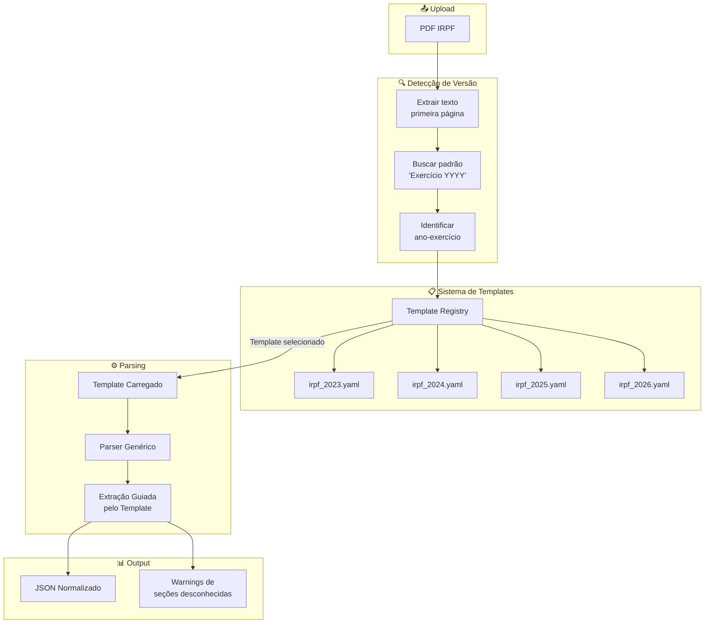
```mermaid
flowchart TB
    subgraph UPLOAD["📤 Upload"]
        PDF[PDF IRPF]
    end
    
    subgraph DETECTION["🔍 Detecção de Versão"]
        EXTRACT_TEXT[Extrair texto<br/>primeira página]
        FIND_YEAR[Buscar padrão<br/>'Exercício YYYY']
        IDENTIFY[Identificar<br/>ano-exercício]
    end
    
    subgraph TEMPLATE_SYSTEM["📋 Sistema de Templates"]
        REGISTRY[Template Registry]
        T2023[irpf_2023.yaml]
        T2024[irpf_2024.yaml]
        T2025[irpf_2025.yaml]
        T2026[irpf_2026.yaml]
    end
    
    subgraph PARSING["⚙️ Parsing"]
        GENERIC_PARSER[Parser Genérico]
        TEMPLATE_LOADED[Template Carregado]
        EXTRACTION[Extração Guiada<br/>pelo Template]
    end
    
    subgraph OUTPUT["📊 Output"]
        JSON_RESULT[JSON Normalizado]
        WARNINGS[Warnings de<br/>seções desconhecidas]
    end
    
    PDF --> EXTRACT_TEXT
    EXTRACT_TEXT --> FIND_YEAR
    FIND_YEAR --> IDENTIFY
    
    IDENTIFY --> REGISTRY
    REGISTRY --> T2023
    REGISTRY --> T2024
    REGISTRY --> T2025
    REGISTRY --> T2026
    
    REGISTRY -->|Template selecionado| TEMPLATE_LOADED
    TEMPLATE_LOADED --> GENERIC_PARSER
    GENERIC_PARSER --> EXTRACTION
    
    EXTRACTION --> JSON_RESULT
    EXTRACTION --> WARNINGS
```

#### Classes do Sistema de Templates

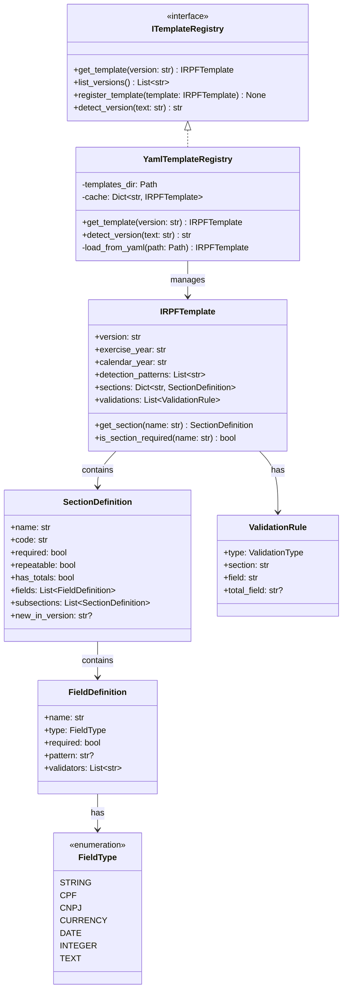
```mermaid
classDiagram
    direction TB
    
    class ITemplateRegistry {
        <<interface>>
        +get_template(version: str) IRPFTemplate
        +list_versions() List~str~
        +register_template(template: IRPFTemplate) None
        +detect_version(text: str) str
    }
    
    class IRPFTemplate {
        +version: str
        +exercise_year: str
        +calendar_year: str
        +detection_patterns: List~str~
        +sections: Dict~str, SectionDefinition~
        +validations: List~ValidationRule~
        +get_section(name: str) SectionDefinition
        +is_section_required(name: str) bool
    }
    
    class SectionDefinition {
        +name: str
        +code: str
        +required: bool
        +repeatable: bool
        +has_totals: bool
        +fields: List~FieldDefinition~
        +subsections: List~SectionDefinition~
        +new_in_version: str?
    }
    
    class FieldDefinition {
        +name: str
        +type: FieldType
        +required: bool
        +pattern: str?
        +validators: List~str~
    }
    
    class FieldType {
        <<enumeration>>
        STRING
        CPF
        CNPJ
        CURRENCY
        DATE
        INTEGER
        TEXT
    }
    
    class ValidationRule {
        +type: ValidationType
        +section: str
        +field: str
        +total_field: str?
    }
    
    class YamlTemplateRegistry {
        -templates_dir: Path
        -cache: Dict~str, IRPFTemplate~
        +get_template(version: str) IRPFTemplate
        +detect_version(text: str) str
        -load_from_yaml(path: Path) IRPFTemplate
    }
    
    ITemplateRegistry <|.. YamlTemplateRegistry
    YamlTemplateRegistry --> IRPFTemplate : manages
    IRPFTemplate --> SectionDefinition : contains
    SectionDefinition --> FieldDefinition : contains
    FieldDefinition --> FieldType : has
    IRPFTemplate --> ValidationRule : has
```

#### Estrutura de Pastas (Implementada)

```
src/irpf_processor/
├── templates/
│   ├── __init__.py
│   ├── registry.py          # YamlTemplateRegistry ✅
│   ├── models.py            # IRPFTemplate, SectionDefinition ✅
│   └── definitions/
│       ├── irpf_2023.yaml   ✅
│       ├── irpf_2024.yaml   ✅
│       └── irpf_2025.yaml   ✅
│
└── infrastructure/extraction/
    ├── irpf_parser.py       # IRPFParser (Facade) ✅
    ├── version_detector.py  # VersionDetector ✅
    ├── text_extractor.py    # PdfTextExtractor ✅
    ├── table_extractor.py   # TableExtractor ✅
    ├── field_extractors.py  # CPF, CNPJ, Currency, Date ✅
    └── extractors/          # Strategy Pattern ✅
        ├── base.py          # ISectionExtractor interface
        ├── taxpayer.py      # TaxpayerExtractor
        ├── assets.py        # AssetsExtractor
        ├── income_pj.py     # IncomePJExtractor
        ├── exempt_income.py # ExemptIncomeExtractor
        ├── exclusive_income.py # ExclusiveIncomeExtractor
        └── rural/           # 5 extratores rurais
```

### 5.10 Diagrama de Extratores de Seção (Implementado)


```mermaid
classDiagram
    direction TB
    
    class ISectionExtractor {
        <<interface>>
        +section_name: str
        +can_extract(context) bool
        +extract(context) Optional~Dict~
    }
    
    class ExtractionContext {
        +full_text: str
        +lines: List~str~
        +pdf_content: bytes
        +template: IRPFTemplate
        +warnings: List~str~
        +field_confidences: Dict
        +add_warning(message)
        +set_field_confidence(path, value)
    }
    
    class TaxpayerExtractor {
        +section_name = "taxpayer_identification"
        +extract() → CPF, Nome, Endereço
    }
    
    class AssetsExtractor {
        +section_name = "assets_declaration"
        +extract() → Bens e Direitos
    }
    
    class IncomePJExtractor {
        +section_name = "income_from_legal_person_to_holder"
        +extract() → Rendimentos PJ
    }
    
    class ExemptIncomeExtractor {
        +section_name = "exempt_income"
        +extract() → Rendimentos Isentos
    }
    
    class ExclusiveIncomeExtractor {
        +section_name = "exclusive_taxation_income"
        +extract() → Tributação Exclusiva
    }
    
    class RuralPropertiesExtractor {
        +section_name = "exploited_rural_properties_in_brazil"
        +extract() → Imóveis Rurais
    }
    
    class RuralIncomeExpenditureExtractor {
        +section_name = "rural_income_and_expenditure_in_brazil"
        +extract() → Receitas/Despesas
    }
    
    class RuralResultsExtractor {
        +section_name = "calculation_of_rural_results_in_brazil"
        +extract() → Apuração Rural
    }
    
    class RuralAssetsExtractor {
        +section_name = "rural_activity_assets_in_brazil"
        +extract() → Bens Rurais
    }
    
    class RuralDebtsExtractor {
        +section_name = "rural_activity_debts_in_brazil"
        +extract() → Dívidas Rurais
    }
    
    ISectionExtractor <|.. TaxpayerExtractor
    ISectionExtractor <|.. AssetsExtractor
    ISectionExtractor <|.. IncomePJExtractor
    ISectionExtractor <|.. ExemptIncomeExtractor
    ISectionExtractor <|.. ExclusiveIncomeExtractor
    ISectionExtractor <|.. RuralPropertiesExtractor
    ISectionExtractor <|.. RuralIncomeExpenditureExtractor
    ISectionExtractor <|.. RuralResultsExtractor
    ISectionExtractor <|.. RuralAssetsExtractor
    ISectionExtractor <|.. RuralDebtsExtractor
    
    TaxpayerExtractor --> ExtractionContext : uses
    AssetsExtractor --> ExtractionContext : uses
```

### 5.11 IRPFParser - Facade Pattern

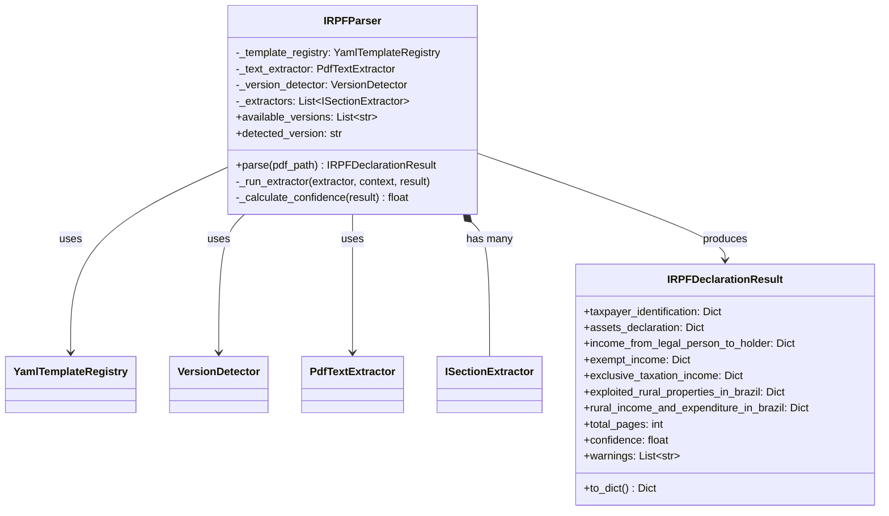
```mermaid
classDiagram
    direction TB
    
    class IRPFParser {
        -_template_registry: YamlTemplateRegistry
        -_text_extractor: PdfTextExtractor
        -_version_detector: VersionDetector
        -_extractors: List~ISectionExtractor~
        +parse(pdf_path) IRPFDeclarationResult
        +available_versions: List~str~
        +detected_version: str
        -_run_extractor(extractor, context, result)
        -_calculate_confidence(result) float
    }
    
    class IRPFDeclarationResult {
        +taxpayer_identification: Dict
        +assets_declaration: Dict
        +income_from_legal_person_to_holder: Dict
        +exempt_income: Dict
        +exclusive_taxation_income: Dict
        +exploited_rural_properties_in_brazil: Dict
        +rural_income_and_expenditure_in_brazil: Dict
        +total_pages: int
        +confidence: float
        +warnings: List~str~
        +to_dict() Dict
    }
    
    IRPFParser --> YamlTemplateRegistry : uses
    IRPFParser --> VersionDetector : uses
    IRPFParser --> PdfTextExtractor : uses
    IRPFParser *-- ISectionExtractor : has many
    IRPFParser --> IRPFDeclarationResult : produces
```

#### Fluxo no Worker

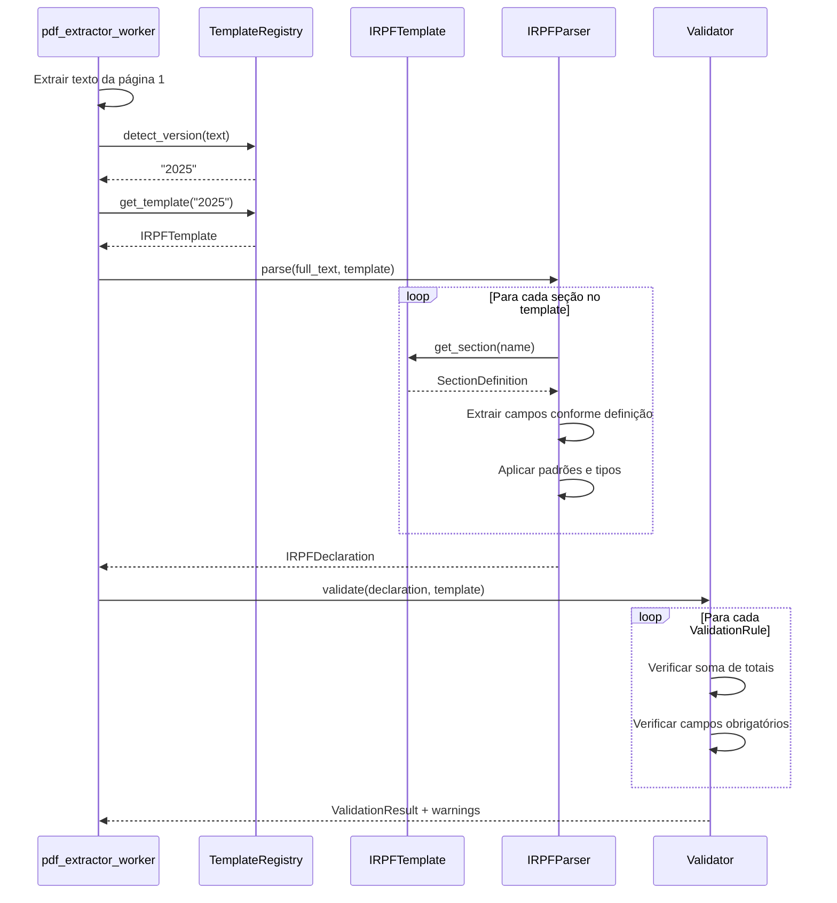
```mermaid
sequenceDiagram
    participant W as pdf_extractor_worker
    participant TR as TemplateRegistry
    participant T as IRPFTemplate
    participant P as IRPFParser
    participant V as Validator
    
    W->>W: Extrair texto da página 1
    W->>TR: detect_version(text)
    TR-->>W: "2025"
    
    W->>TR: get_template("2025")
    TR-->>W: IRPFTemplate
    
    W->>P: parse(full_text, template)
    
    loop Para cada seção no template
        P->>T: get_section(name)
        T-->>P: SectionDefinition
        P->>P: Extrair campos conforme definição
        P->>P: Aplicar padrões e tipos
    end
    
    P-->>W: IRPFDeclaration
    
    W->>V: validate(declaration, template)
    
    loop Para cada ValidationRule
        V->>V: Verificar soma de totais
        V->>V: Verificar campos obrigatórios
    end
    
    V-->>W: ValidationResult + warnings
```

---

## 6. Fluxo de Processamento de Documento

Sequência completa desde o upload até o estado READY.

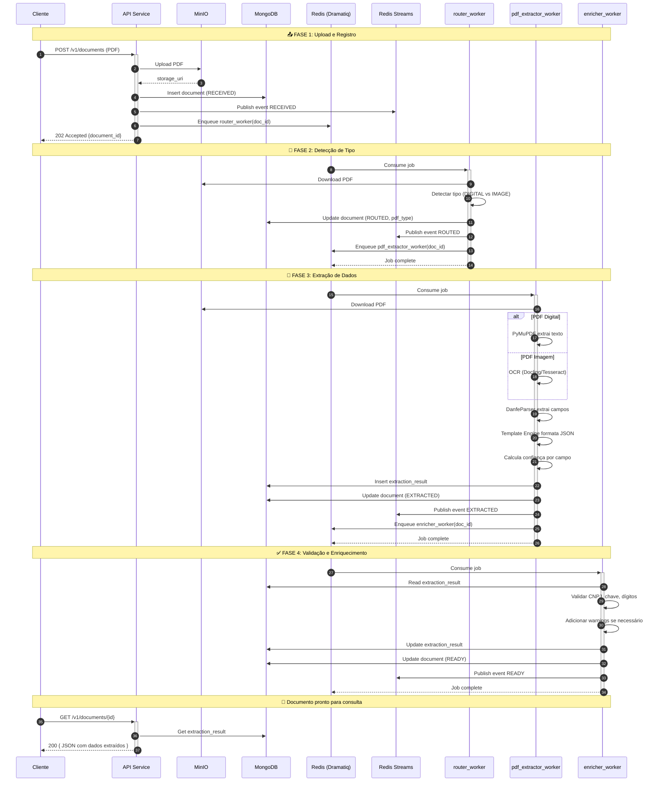
```mermaid
sequenceDiagram
    autonumber
    participant C as Cliente
    participant API as API Service
    participant S3 as MinIO
    participant DB as MongoDB
    participant Q as Redis (Dramatiq)
    participant EV as Redis Streams
    participant RW as router_worker
    participant EX as pdf_extractor_worker
    participant ENR as enricher_worker

    Note over C,ENR: 📤 FASE 1: Upload e Registro

    C->>+API: POST /v1/documents (PDF)
    API->>S3: Upload PDF
    S3-->>API: storage_uri
    API->>DB: Insert document (RECEIVED)
    API->>EV: Publish event RECEIVED
    API->>Q: Enqueue router_worker(doc_id)
    API-->>-C: 202 Accepted {document_id}

    Note over C,ENR: 🔀 FASE 2: Detecção de Tipo

    Q->>+RW: Consume job
    RW->>S3: Download PDF
    RW->>RW: Detectar tipo (DIGITAL vs IMAGE)
    RW->>DB: Update document (ROUTED, pdf_type)
    RW->>EV: Publish event ROUTED
    RW->>Q: Enqueue pdf_extractor_worker(doc_id)
    RW-->>-Q: Job complete

    Note over C,ENR: 📄 FASE 3: Extração de Dados

    Q->>+EX: Consume job
    EX->>S3: Download PDF
    
    alt PDF Digital
        EX->>EX: PyMuPDF extrai texto
    else PDF Imagem
        EX->>EX: OCR (Docling/Tesseract)
    end
    
    EX->>EX: DanfeParser extrai campos
    EX->>EX: Template Engine formata JSON
    EX->>EX: Calcula confiança por campo
    EX->>DB: Insert extraction_result
    EX->>DB: Update document (EXTRACTED)
    EX->>EV: Publish event EXTRACTED
    EX->>Q: Enqueue enricher_worker(doc_id)
    EX-->>-Q: Job complete

    Note over C,ENR: ✅ FASE 4: Validação e Enriquecimento

    Q->>+ENR: Consume job
    ENR->>DB: Read extraction_result
    ENR->>ENR: Validar CNPJ, chave, dígitos
    ENR->>ENR: Adicionar warnings se necessário
    ENR->>DB: Update extraction_result
    ENR->>DB: Update document (READY)
    ENR->>EV: Publish event READY
    ENR-->>-Q: Job complete

    Note over C,ENR: 🎯 Documento pronto para consulta

    C->>+API: GET /v1/documents/{id}
    API->>DB: Get extraction_result
    API-->>-C: 200 { JSON com dados extraídos }
```

---

## 7. Máquina de Estados do Documento

Estados e transições válidas.

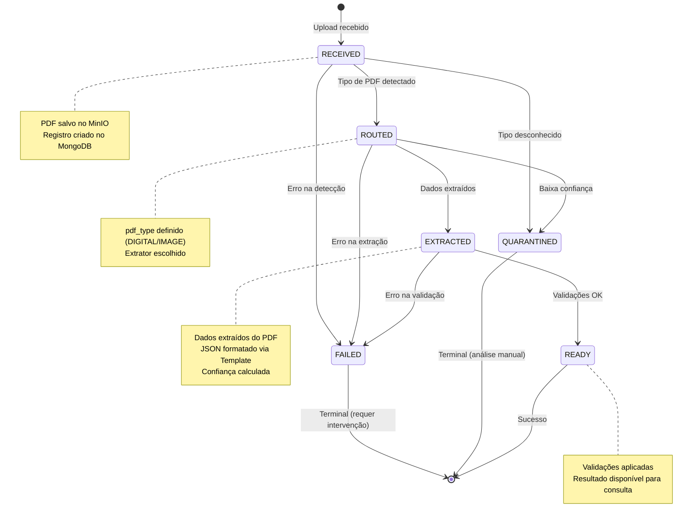
```mermaid
stateDiagram-v2
    [*] --> RECEIVED: Upload recebido

    RECEIVED --> ROUTED: Tipo de PDF detectado
    RECEIVED --> FAILED: Erro na detecção
    RECEIVED --> QUARANTINED: Tipo desconhecido

    ROUTED --> EXTRACTED: Dados extraídos
    ROUTED --> FAILED: Erro na extração
    ROUTED --> QUARANTINED: Baixa confiança

    EXTRACTED --> READY: Validações OK
    EXTRACTED --> FAILED: Erro na validação

    FAILED --> [*]: Terminal (requer intervenção)
    QUARANTINED --> [*]: Terminal (análise manual)
    READY --> [*]: Sucesso

    note right of RECEIVED
        PDF salvo no MinIO
        Registro criado no MongoDB
    end note

    note right of ROUTED
        pdf_type definido (DIGITAL/IMAGE)
        Extrator escolhido
    end note

    note right of EXTRACTED
        Dados extraídos do PDF
        JSON formatado via Template
        Confiança calculada
    end note

    note right of READY
        Validações aplicadas
        Resultado disponível para consulta
    end note
```

---

## 8. Modelo de Dados

Estrutura das coleções MongoDB.

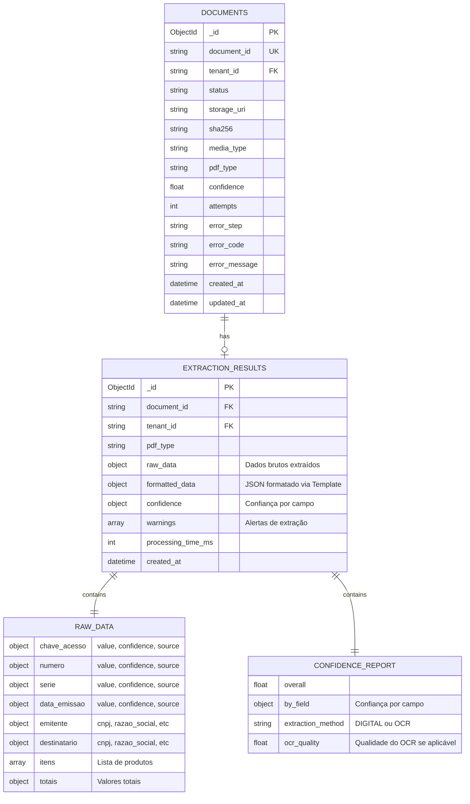
```mermaid
erDiagram
    DOCUMENTS {
        ObjectId _id PK
        string document_id UK
        string tenant_id FK
        string status
        string storage_uri
        string sha256
        string media_type
        string pdf_type
        float confidence
        int attempts
        string error_step
        string error_code
        string error_message
        datetime created_at
        datetime updated_at
    }

    EXTRACTION_RESULTS {
        ObjectId _id PK
        string document_id FK
        string tenant_id FK
        string pdf_type
        object raw_data "Dados brutos extraídos"
        object formatted_data "JSON formatado via Template"
        object confidence "Confiança por campo"
        array warnings "Alertas de extração"
        int processing_time_ms
        datetime created_at
    }

    RAW_DATA {
        object chave_acesso "value, confidence, source"
        object numero "value, confidence, source"
        object serie "value, confidence, source"
        object data_emissao "value, confidence, source"
        object emitente "cnpj, razao_social, etc"
        object destinatario "cnpj, razao_social, etc"
        array itens "Lista de produtos"
        object totais "Valores totais"
    }

    CONFIDENCE_REPORT {
        float overall
        object by_field "Confiança por campo"
        string extraction_method "DIGITAL ou OCR"
        float ocr_quality "Qualidade do OCR se aplicável"
    }

    DOCUMENTS ||--o| EXTRACTION_RESULTS : "has"
    EXTRACTION_RESULTS ||--|| RAW_DATA : "contains"
    EXTRACTION_RESULTS ||--|| CONFIDENCE_REPORT : "contains"
```

---

## 9. Arquitetura de Eventos (Redis Streams)

Sistema de eventos para SSE com replay.

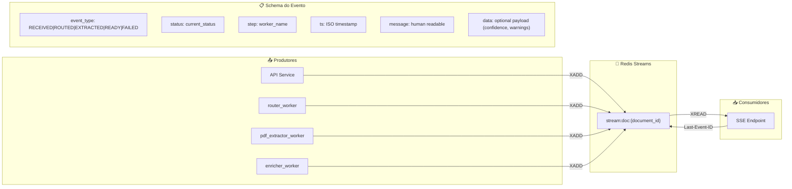
```mermaid
flowchart LR
    subgraph Producers["📤 Produtores"]
        API[API Service]
        W1[router_worker]
        W2[pdf_extractor_worker]
        W3[enricher_worker]
    end

    subgraph Redis["🔴 Redis Streams"]
        STREAM["stream:doc:{document_id}"]
    end

    subgraph Consumers["📥 Consumidores"]
        SSE[SSE Endpoint]
    end

    subgraph EventSchema["📋 Schema do Evento"]
        direction TB
        E1["event_type: RECEIVED|ROUTED|EXTRACTED|READY|FAILED"]
        E2["status: current_status"]
        E3["step: worker_name"]
        E4["ts: ISO timestamp"]
        E5["message: human readable"]
        E6["data: optional payload (confidence, warnings)"]
    end

    API -->|XADD| STREAM
    W1 -->|XADD| STREAM
    W2 -->|XADD| STREAM
    W3 -->|XADD| STREAM

    STREAM -->|XREAD| SSE
    
    SSE -->|"Last-Event-ID"| STREAM
```

### Fluxo SSE com Replay

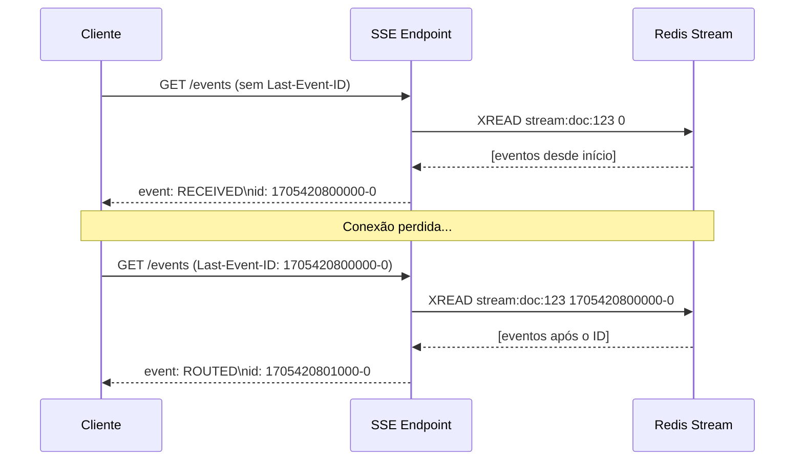
```mermaid
sequenceDiagram
    participant C as Cliente
    participant SSE as SSE Endpoint
    participant RS as Redis Stream

    C->>SSE: GET /events (sem Last-Event-ID)
    SSE->>RS: XREAD stream:doc:123 0
    RS-->>SSE: [eventos desde início]
    SSE-->>C: event: RECEIVED\nid: 1705420800000-0

    Note over C,RS: Conexão perdida...

    C->>SSE: GET /events (Last-Event-ID: 1705420800000-0)
    SSE->>RS: XREAD stream:doc:123 1705420800000-0
    RS-->>SSE: [eventos após o ID]
    SSE-->>C: event: ROUTED\nid: 1705420801000-0
```

---

## 10. Estratégia de Detecção de Tipo de PDF

Algoritmo para identificar se o PDF é digital (texto selecionável) ou imagem (escaneado).

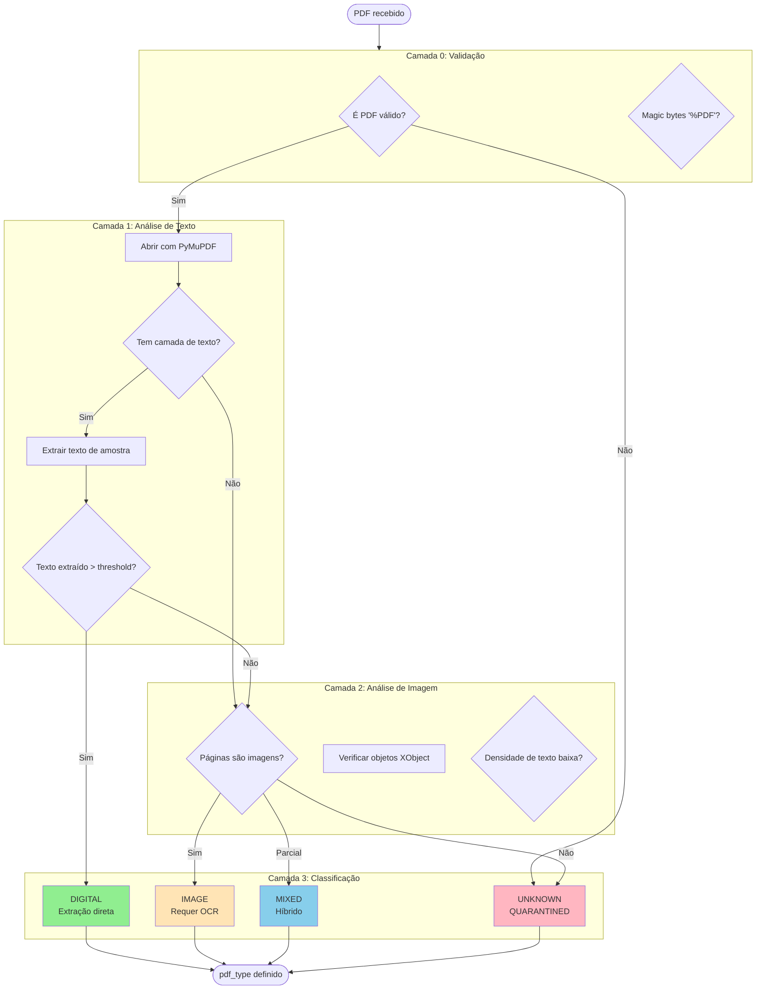
```mermaid
flowchart TD
    START([PDF recebido]) --> L0

    subgraph L0["Camada 0: Validação"]
        M1{É PDF válido?}
        M2{Magic bytes '%PDF'?}
    end

    subgraph L1["Camada 1: Análise de Texto"]
        T1[Abrir com PyMuPDF]
        T2{Tem camada de texto?}
        T3[Extrair texto de amostra]
        T4{Texto extraído > threshold?}
    end

    subgraph L2["Camada 2: Análise de Imagem"]
        I1{Páginas são imagens?}
        I2[Verificar objetos XObject]
        I3{Densidade de texto baixa?}
    end

    subgraph L3["Camada 3: Classificação"]
        C1[DIGITAL<br/>Extração direta]
        C2[IMAGE<br/>Requer OCR]
        C3[MIXED<br/>Híbrido]
        C4[UNKNOWN<br/>QUARANTINED]
    end

    M1 -->|Não| C4
    M1 -->|Sim| T1
    T1 --> T2
    T2 -->|Sim| T3
    T2 -->|Não| I1
    T3 --> T4
    T4 -->|Sim| C1
    T4 -->|Não| I1
    I1 -->|Sim| C2
    I1 -->|Parcial| C3
    I1 -->|Não| C4

    C1 --> END([pdf_type definido])
    C2 --> END
    C3 --> END
    C4 --> END

    style C1 fill:#90EE90
    style C2 fill:#FFE4B5
    style C3 fill:#87CEEB
    style C4 fill:#FFB6C1
```

### Critérios de Classificação

| Tipo | Critério | Extrator |
|------|----------|----------|
| **DIGITAL** | Texto selecionável, > 100 chars por página | PyMuPDF/pdfplumber |
| **IMAGE** | Sem texto, páginas são imagens | Docling/Tesseract OCR |
| **MIXED** | Algumas páginas texto, outras imagem | Híbrido |
| **UNKNOWN** | PDF corrompido ou formato não suportado | Quarentena |

---

## 11. Arquitetura de Deploy (Docker Compose)

Configuração de containers para ambiente local/desenvolvimento.

```mermaid
flowchart TB
    subgraph DockerCompose["🐳 Docker Compose"]
        subgraph Network["bridge: nfe-network"]
            API_C[api-service<br/>:8000]
            WORKER_C[worker-service<br/>dramatiq]
            MONGO_C[(mongo<br/>:27017)]
            REDIS_C[(redis<br/>:6379)]
            MINIO_C[(minio<br/>:9000/:9001)]
        end
    end

    subgraph Volumes["📁 Volumes"]
        V1[mongo-data]
        V2[redis-data]
        V3[minio-data]
    end

    HOST[Host :8000] --> API_C
    HOST2[Host :9001] --> MINIO_C

    MONGO_C --> V1
    REDIS_C --> V2
    MINIO_C --> V3

    API_C <--> MONGO_C
    API_C <--> REDIS_C
    API_C <--> MINIO_C
    WORKER_C <--> MONGO_C
    WORKER_C <--> REDIS_C
    WORKER_C <--> MINIO_C
```

---

## 12. Decisões Arquiteturais (ADR Summary)

| ID | Decisão | Justificativa |
|----|---------|---------------|
| ADR-001 | **MongoDB** como document store | Schema flexível para resultados, suporte a queries complexas, motor async |
| ADR-002 | **Redis Streams** para eventos | Persistência de eventos, suporte a replay, baixa latência |
| ADR-003 | **Dramatiq** para workers | Simples, confiável, retry built-in, Redis como broker |
| ADR-004 | **MinIO** para storage | S3-compatible, self-hosted, imutabilidade de PDFs originais |
| ADR-005 | **PyMuPDF** para PDF digital | Rápido, preciso, extração de texto e tabelas |
| ADR-006 | **Docling** para OCR | IBM, suporte a layout, fallback para Tesseract |
| ADR-007 | **Sistema de Templates** | Flexibilidade no formato de saída, compatibilidade com sistemas legados |
| ADR-008 | **Confiança por campo** | Transparência na qualidade da extração, suporte a revisão manual |
| ADR-009 | **SSE com replay** | Reconexão sem perda de eventos, melhor UX |
| ADR-010 | **CQRS simplificado** | Workers escrevem, API lê, separação clara |

---

## 13. Considerações de Segurança

```mermaid
flowchart LR
    subgraph Security["🔒 Camadas de Segurança"]
        direction TB
        S1[Multi-tenant isolation<br/>tenant_id em todas queries]
        S2[Validação de entrada<br/>Pydantic schemas]
        S3[SHA256 deduplication<br/>Evita reprocessamento]
        S4[Imutabilidade raw<br/>Arquivos originais preservados]
        S5[Audit trail<br/>Eventos persistidos]
    end
```

---

## 14. Métricas e Observabilidade

| Métrica | Tipo | Descrição |
|---------|------|-----------|
| `pdf_uploaded_total` | Counter | Total de uploads |
| `pdf_processed_total` | Counter | Total processados por status |
| `pdf_type_detected` | Counter | Por tipo (DIGITAL/IMAGE) |
| `extraction_confidence` | Histogram | Distribuição de confiança |
| `extraction_duration_seconds` | Histogram | Tempo de extração |
| `ocr_used_total` | Counter | Quantas vezes OCR foi usado |
| `worker_jobs_in_queue` | Gauge | Jobs pendentes por worker |
| `sse_connections_active` | Gauge | Conexões SSE ativas |

### Logs Estruturados

```json
{
  "timestamp": "2026-01-16T10:30:00Z",
  "level": "INFO",
  "correlation_id": "doc_abc123",
  "tenant_id": "tenant_xyz",
  "worker": "pdf_extractor_worker",
  "event": "extraction_complete",
  "pdf_type": "DIGITAL",
  "confidence": 0.95,
  "duration_ms": 1245
}
```

---

## 15. Escalabilidade Futura

```mermaid
flowchart TB
    subgraph Current["MVP (Docker Compose)"]
        A1[1x API]
        A2[1x Worker]
        A3[1x Mongo]
        A4[1x Redis]
        A5[1x MinIO]
    end

    subgraph Future["Produção (Kubernetes)"]
        B1[N x API pods<br/>HPA]
        B2[N x Worker pods<br/>por tipo]
        B3[MongoDB Atlas<br/>ou ReplicaSet]
        B4[Redis Cluster<br/>ou ElastiCache]
        B5[AWS S3<br/>ou MinIO Cluster]
    end

    Current -->|Scale| Future
```

---

## 16. Referências

### Documentação Interna
- [Especificação Técnica](../../spec.md)
- [Plano de Implementação](../../PLAN.md)
- [Extração de PDF](./PDF_EXTRACTION.md) ⭐ **Principal**
- [Parser e Sistema de Templates](./PARSER_TEMPLATES.md)

### Documentação Externa
- [NFe Layout 4.00 — SEFAZ](https://www.nfe.fazenda.gov.br/portal/principal.aspx)
- [FastAPI Documentation](https://fastapi.tiangolo.com/)
- [Dramatiq Documentation](https://dramatiq.io/)
- [Redis Streams](https://redis.io/docs/data-types/streams/)


