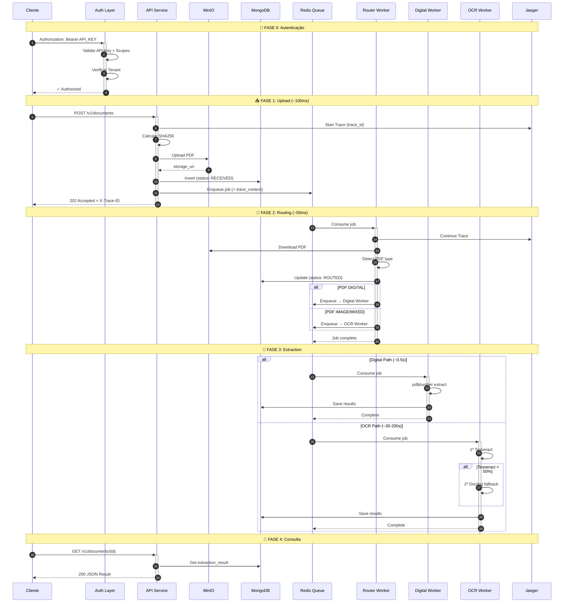
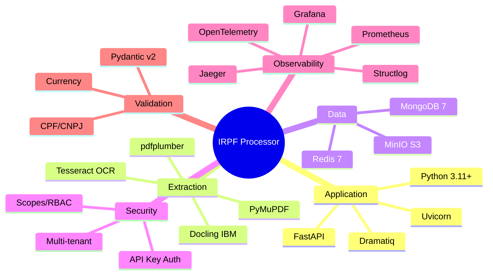
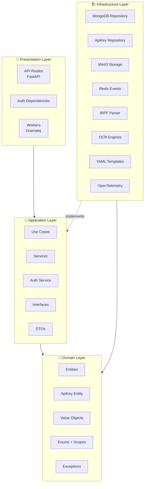
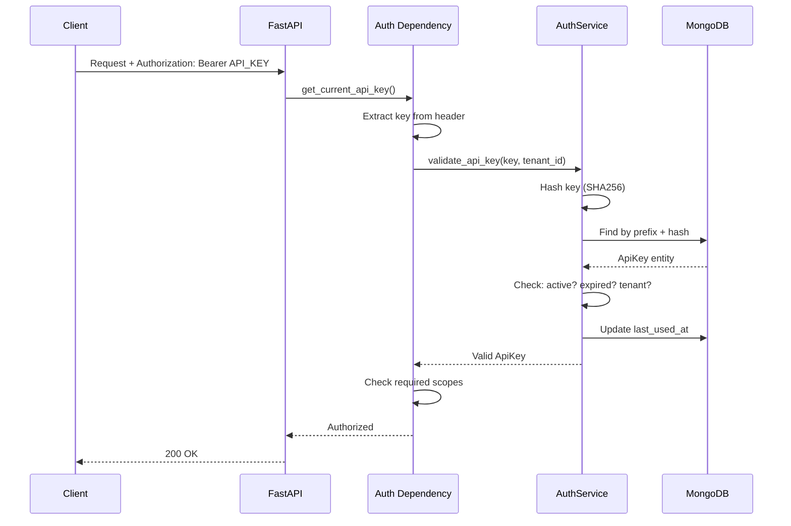
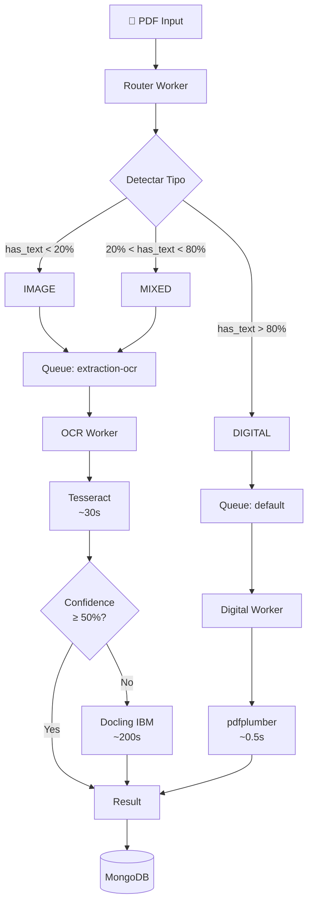
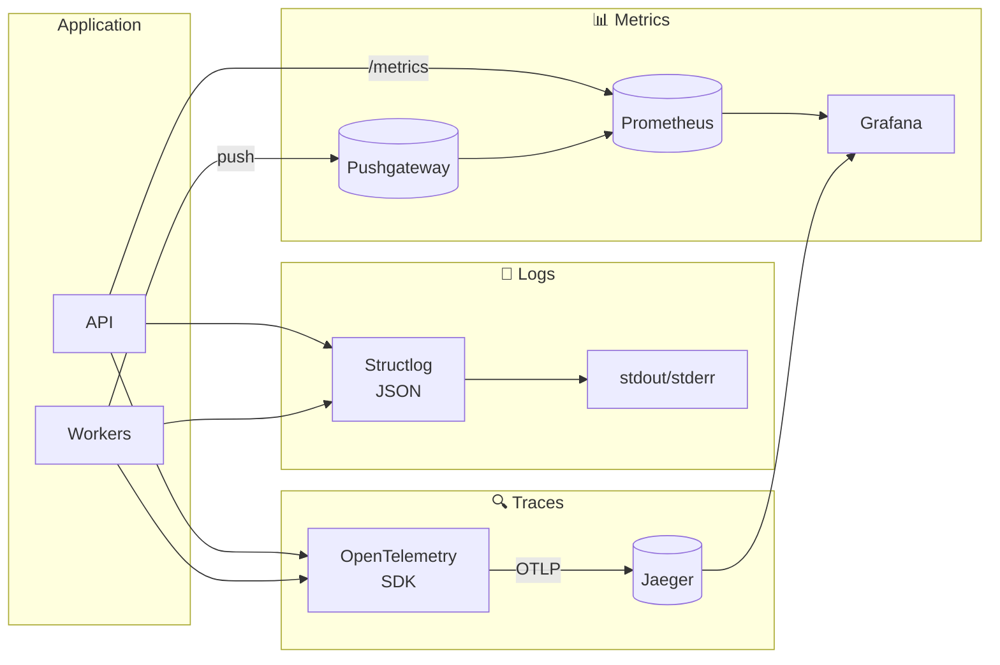
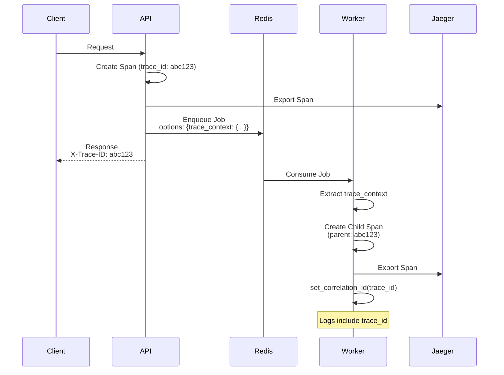
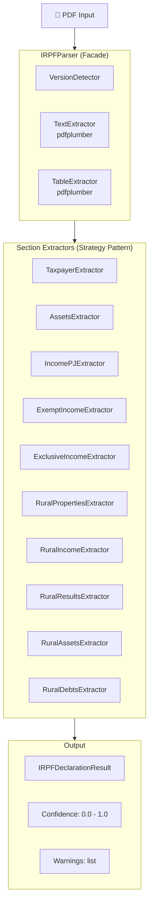
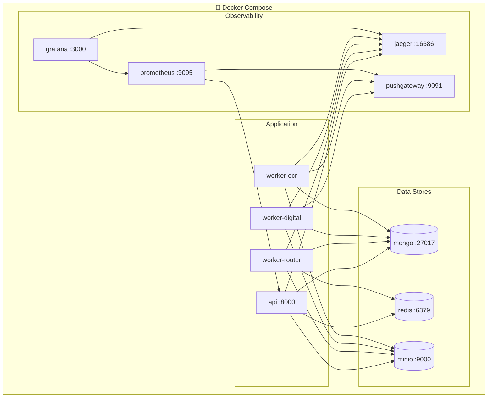
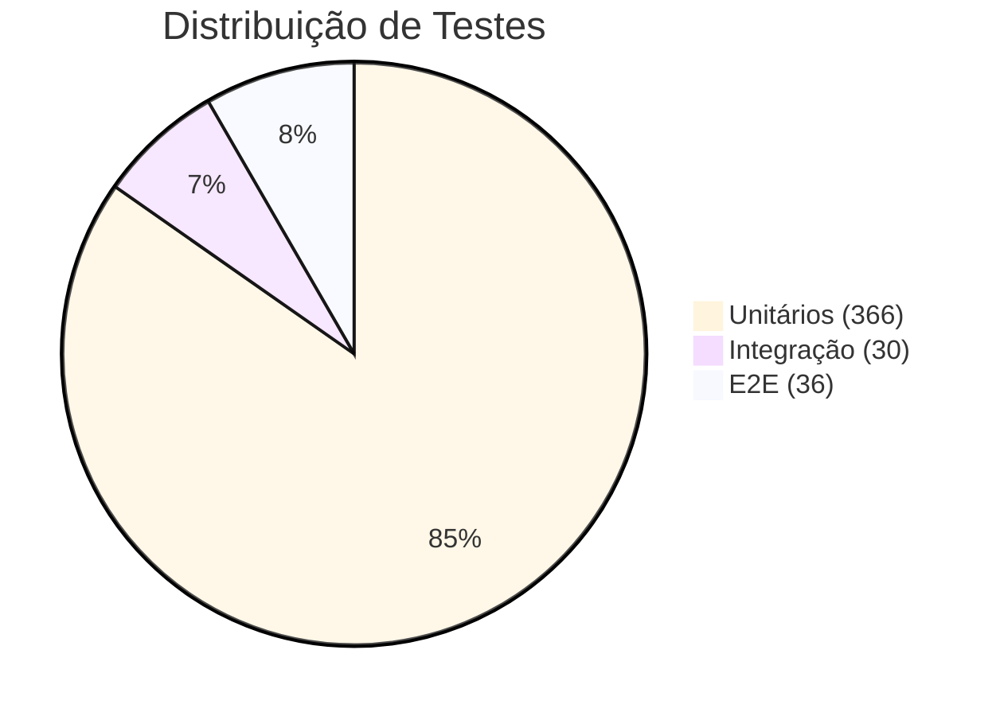

# 🏛️ IRPF Processor — Visão Geral da Arquitetura

**Versão:** 3.0  
**Data:** 2026-01-17  
**Status:** Production Ready

---

## 📈 Métricas do Projeto

| Categoria | Métrica | Valor |
|-----------|---------|-------|
| 📝 **Código** | Linhas de código | ~12,000 |
| 📝 **Código** | Arquivos Python | ~95 |
| 📝 **Código** | Templates YAML | 3 |
| 🧪 **Testes** | Testes unitários | 366 |
| 🧪 **Testes** | Testes E2E | 36 |
| 🧪 **Testes** | Cobertura alvo | >80% |
| 📄 **Extração** | Extratores de seção | 10 |
| 📄 **Extração** | Versões suportadas | 3 (2023-2025) |
| 📄 **Extração** | Campos extraídos | 50+ |
| 🔒 **Segurança** | Autenticação | API Key (M2M) |
| 🔒 **Segurança** | Scopes | 4 |
| 📊 **Observabilidade** | Métricas | Prometheus |
| 📊 **Observabilidade** | Tracing | OpenTelemetry + Jaeger |

---

## 📊 Dashboard de Status

| Feature | Status |
|---------|--------|
| API REST (FastAPI) | ✅ Implementado |
| Upload de Documentos | ✅ Implementado |
| Workers Dramatiq (3 tipos) | ✅ Implementado |
| MongoDB + Redis + MinIO | ✅ Implementado |
| Parser IRPF (10 extratores) | ✅ Implementado |
| Detecção de Versão (2023-2025) | ✅ Implementado |
| Sistema de Templates YAML | ✅ Implementado |
| Search API (CPF, Ano, Cidade) | ✅ Implementado |
| **OCR Dual-Engine** | ✅ Implementado |
| **Autenticação API Key** | ✅ Implementado |
| **Multi-tenancy** | ✅ Implementado |
| **Distributed Tracing** | ✅ Implementado |
| **Testes E2E Automatizados** | ✅ Implementado |
| Prometheus + Grafana + Jaeger | ✅ Implementado |
| SSE Events | ⏳ Pendente |

---

## 1. Arquitetura de Alto Nível

```mermaid
flowchart TB
    subgraph Clients["🌐 Clients"]
        Postman[Postman]
        Frontend[Frontend<br/>Vue/React]
        ERP[ERP Systems]
        Swagger[Swagger UI]
    end

    subgraph Gateway["🔐 Security Layer"]
        Auth[API Key<br/>Authentication]
        Tenant[Multi-tenant<br/>Isolation]
    end

    subgraph API["📡 API Service :8000"]
        direction TB
        Upload[POST /v1/documents]
        Status[GET /status]
        Search[GET /search]
        AuthAPI[/v1/auth/*]
        Health[GET /health]
        Metrics[GET /metrics]
    end

    subgraph Workers["👷 Worker Services"]
        direction TB
        RouterW[Router Worker<br/>extraction-router]
        DigitalW[Digital Worker<br/>default queue]
        OCRW[OCR Worker<br/>extraction-ocr]
    end

    subgraph OCR["🔍 OCR Engines"]
        Tesseract[Tesseract<br/>~30s]
        Docling[Docling IBM<br/>~200s fallback]
    end

    subgraph Infra["🏗️ Infrastructure"]
        MongoDB[(MongoDB<br/>:27017)]
        Redis[(Redis<br/>:6379)]
        MinIO[(MinIO<br/>:9000)]
    end

    subgraph Observability["📊 Observability Stack"]
        Prometheus[Prometheus<br/>:9095]
        Grafana[Grafana<br/>:3000]
        Jaeger[Jaeger<br/>:16686]
        Pushgateway[Pushgateway<br/>:9091]
    end

    Clients --> Gateway
    Gateway --> API
    API --> MongoDB
    API --> Redis
    API --> MinIO
    API -.->|Enqueue| Workers
    
    RouterW -->|DIGITAL| DigitalW
    RouterW -->|IMAGE/MIXED| OCRW
    OCRW --> Tesseract
    OCRW -.->|fallback| Docling
    
    Workers --> MongoDB
    Workers --> MinIO
    Workers --> Pushgateway
    
    API -.->|traces| Jaeger
    Workers -.->|traces| Jaeger
    Prometheus -->|Scrape| API
    Prometheus -->|Scrape| Pushgateway
    Grafana --> Prometheus
    Grafana --> Jaeger
```

---

## 2. Fluxo de Processamento de Documento



---

## 3. Stack Tecnológica



---

## 4. Arquitetura de Camadas (Clean Architecture)



---

## 5. Estrutura de Pastas

```
src/irpf_processor/
├── main.py                          # FastAPI entrypoint
├── config.py                        # Pydantic Settings
│
├── domain/                          # 🎯 DOMAIN LAYER
│   ├── entities/
│   │   ├── document.py
│   │   └── api_key.py              # 🔐 API Key entity
│   ├── enums/
│   │   ├── document_status.py
│   │   ├── pdf_type.py
│   │   └── auth_scope.py           # 🔐 Scopes enum
│   ├── exceptions/
│   │   ├── domain_exceptions.py
│   │   └── auth_exceptions.py      # 🔐 Auth exceptions
│   └── value_objects/
│
├── application/                     # 🔄 APPLICATION LAYER
│   ├── interfaces/
│   │   ├── repositories.py
│   │   ├── event_publisher.py
│   │   └── auth_repository.py      # 🔐 Auth interface
│   ├── services/
│   │   ├── document_service.py
│   │   └── auth_service.py         # 🔐 Auth service
│   └── dto/
│
├── infrastructure/                  # 🏗️ INFRASTRUCTURE LAYER
│   ├── persistence/
│   │   ├── document_repository.py
│   │   ├── api_key_repository.py   # 🔐 API Key repo
│   │   └── database.py
│   ├── storage/minio_storage.py
│   └── extraction/
│       ├── irpf_parser.py          # Facade
│       ├── version_detector.py
│       ├── text_extractor.py
│       ├── table_extractor.py
│       ├── extractors/             # 10 Strategy extractors
│       └── ocr/                    # 🔍 OCR Engines
│           ├── tesseract_engine.py
│           ├── docling_engine.py
│           ├── ocr_orchestrator.py
│           └── pdf_type_detector.py
│
├── presentation/                    # 📡 PRESENTATION LAYER
│   ├── api/
│   │   ├── routes/
│   │   │   ├── documents.py
│   │   │   ├── search.py
│   │   │   ├── health.py
│   │   │   └── auth.py             # 🔐 Auth endpoints
│   │   └── dependencies/
│   │       └── auth.py             # 🔐 Auth middleware
│   └── workers/
│       ├── broker.py               # + OpenTelemetry middleware
│       ├── router_worker.py
│       ├── extraction_worker.py
│       └── ocr_worker.py
│
├── shared/                          # 🛠️ SHARED
│   ├── logging.py                  # Structlog + trace context
│   ├── metrics.py                  # Prometheus
│   ├── tracing.py                  # 📊 OpenTelemetry
│   └── instrumentation.py          # 📊 Auto-instrumentation
│
├── templates/definitions/           # 📋 YAML TEMPLATES
│   ├── irpf_2023.yaml
│   ├── irpf_2024.yaml
│   └── irpf_2025.yaml
│
└── cli/                             # 🛠️ CLI TOOLS
    ├── create_api_key.py           # 🔐 Bootstrap API Key
    ├── generate_test_models.py
    └── sync_layouts.py

tests/
├── unit/                            # Testes unitários
├── integration/                     # Testes de integração
└── e2e/                             # 🧪 Testes E2E
    ├── conftest.py
    ├── test_health.py
    ├── test_document_flow.py
    ├── test_search_flow.py
    └── test_auth_flow.py

scripts/
├── run_e2e_tests.py                # 🧪 Executor E2E
└── update_deps_lock.sh             # 📦 Lock dependencies
```

---

## 6. Sistema de Segurança

### 6.1 Arquitetura de Autenticação



### 6.2 Scopes e Permissões

| Scope | Permissão | Endpoints |
|-------|-----------|-----------|
| `documents:write` | Upload de documentos | POST /v1/documents |
| `documents:read` | Consultar status/resultado | GET /v1/documents/* |
| `search:read` | Buscar declarações | GET /v1/irpf/search/* |
| `admin:keys` | Gerenciar API Keys | /v1/auth/keys/* |

### 6.3 Estrutura da API Key

```
irpf_ak_<random_48_chars>
   │
   └─ Prefixo identificador
   
Armazenamento:
- key_prefix: "irpf_ak_" (para lookup)
- key_hash: SHA256(full_key) (para validação)
```

---

## 7. Sistema OCR

### 7.1 Pipeline de Detecção e Roteamento



### 7.2 Comparação de Engines

| Engine | Velocidade | Precisão | Uso |
|--------|------------|----------|-----|
| **pdfplumber** | ~0.5s | 95% | PDFs digitais |
| **Tesseract** | ~30s | 70% | OCR primário |
| **Docling** | ~200s | 72% | Fallback (tabelas complexas) |

---

## 8. Sistema de Observabilidade

### 8.1 Três Pilares



### 8.2 Propagação de Contexto



### 8.3 Métricas Disponíveis

| Métrica | Tipo | Labels |
|---------|------|--------|
| `irpf_documents_uploaded_total` | Counter | tenant_id |
| `irpf_documents_processed_total` | Counter | tenant_id, status, pdf_type |
| `irpf_extraction_duration_seconds` | Histogram | tenant_id, pdf_type, version |
| `irpf_ocr_usage_total` | Counter | tenant_id, ocr_engine |
| `irpf_ocr_duration_seconds` | Histogram | tenant_id, ocr_engine |
| `irpf_ocr_confidence` | Histogram | tenant_id, ocr_engine |
| `irpf_api_request_duration_seconds` | Histogram | method, endpoint, status_code |

---

## 9. Sistema de Parser IRPF

### 9.1 Arquitetura do Parser



### 9.2 Sistema de Templates YAML

```yaml
# templates/definitions/irpf_2025.yaml
metadata:
  version: "2025"
  exercise_year: "2025"
  calendar_year: "2024"

sections:
  taxpayer_identification:
    name: "Identificação do Contribuinte"
    required: true
    fields:
      - { name: cpf, type: cpf, required: true }
      - { name: name, type: string, required: true }
      
  assets_declaration:
    name: "Bens e Direitos"
    repeatable: true
    has_totals: true
```

---

## 10. Docker Compose Services



---

## 11. Testes

### 11.1 Pirâmide de Testes



### 11.2 Cobertura por Componente

| Componente | Testes | Cobertura |
|------------|--------|-----------|
| Domain (Entities, Enums) | 45 | ~95% |
| Field Extractors | 62 | ~90% |
| Section Extractors | 85 | ~85% |
| Auth Service | 28 | ~90% |
| API Routes | 52 | ~85% |
| OCR Engines | 35 | ~80% |
| E2E Flows | 36 | Full paths |

### 11.3 Cenários E2E

| Cenário | Arquivo | Testes |
|---------|---------|--------|
| Health & Ready | test_health.py | 4 |
| Document Flow | test_document_flow.py | 9 |
| Search Flow | test_search_flow.py | 9 |
| Auth Flow | test_auth_flow.py | 14 |

---

## 12. Decisões Arquiteturais (ADRs)

### ADR-001: MongoDB como Document Store
| Aspecto | Detalhe |
|---------|---------|
| **Contexto** | Armazenar declarações IRPF com estrutura variável |
| **Decisão** | Usar MongoDB |
| **Justificativa** | Schema flexível, documentos JSON, motor async |

### ADR-002: API Key Authentication
| Aspecto | Detalhe |
|---------|---------|
| **Contexto** | Autenticação M2M para sistemas bancários |
| **Decisão** | API Key com scopes |
| **Justificativa** | Simples, stateless, multi-tenant, auditável |

### ADR-003: OpenTelemetry para Tracing
| Aspecto | Detalhe |
|---------|---------|
| **Contexto** | Rastrear requests através de API + Workers |
| **Decisão** | OpenTelemetry + Jaeger |
| **Justificativa** | Vendor-neutral, propagação automática, visualização |

### ADR-004: Dual OCR Engine
| Aspecto | Detalhe |
|---------|---------|
| **Contexto** | Extrair texto de PDFs escaneados |
| **Decisão** | Tesseract (primário) + Docling (fallback) |
| **Justificativa** | Balance velocidade/precisão, fallback automático |

### ADR-005: Dependências Travadas
| Aspecto | Detalhe |
|---------|---------|
| **Contexto** | Builds reproduzíveis em produção |
| **Decisão** | requirements.lock com versões fixas |
| **Justificativa** | Previsibilidade, segurança, CI/CD confiável |

---

## 13. Links Úteis

| Recurso | URL | Descrição |
|---------|-----|-----------|
| **API** | http://localhost:8000 | FastAPI REST API |
| **Swagger** | http://localhost:8000/docs | Documentação interativa |
| **ReDoc** | http://localhost:8000/redoc | Documentação alternativa |
| **Grafana** | http://localhost:3000 | Dashboards (admin/admin) |
| **Prometheus** | http://localhost:9095 | Queries de métricas |
| **Jaeger** | http://localhost:16686 | Distributed Tracing |
| **MinIO** | http://localhost:9001 | Object storage |

---

## 14. Comandos Essenciais

```bash
# Subir infraestrutura
docker compose up -d

# Ver logs
docker compose logs -f api worker-router worker-digital worker-ocr

# Testar health
curl http://localhost:8000/health

# Criar API Key admin
python -m irpf_processor.cli.create_api_key \
  --tenant-id meu-tenant \
  --name "Admin" \
  --admin

# Upload documento
curl -X POST http://localhost:8000/v1/documents \
  -H "X-Tenant-ID: meu-tenant" \
  -H "Authorization: Bearer $API_KEY" \
  -F "file=@documento.pdf"

# Buscar por CPF
curl "http://localhost:8000/v1/irpf/search/by-cpf/123.456.789-00" \
  -H "X-Tenant-ID: meu-tenant" \
  -H "Authorization: Bearer $API_KEY"

# Rodar testes E2E
export E2E_API_KEY="irpf_ak_xxxxx"
python scripts/run_e2e_tests.py

# Atualizar dependências
./scripts/update_deps_lock.sh
```

---

<div align="center">

**Feito por Felipe Scaphe com ❤️ para o AsaBank**

*Janeiro 2026*

---

### 📊 Estatísticas Finais

| Métrica | Valor |
|---------|-------|
| Linhas de código | ~12,000 |
| Testes automatizados | 432 |
| Extratores de seção | 10 |
| Templates YAML | 3 (2023-2025) |
| OCR Engines | 2 (Tesseract + Docling) |
| Scopes de segurança | 4 |
| Tempo médio (digital) | 0.5s |
| Tempo médio (OCR) | 30s |

</div>
