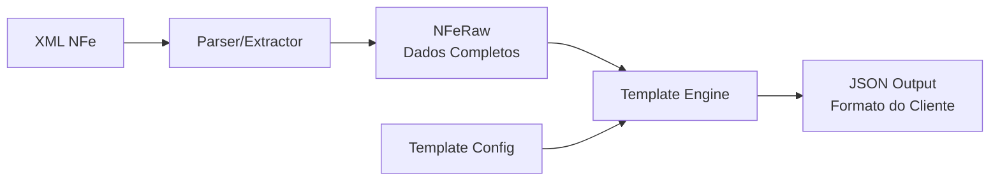
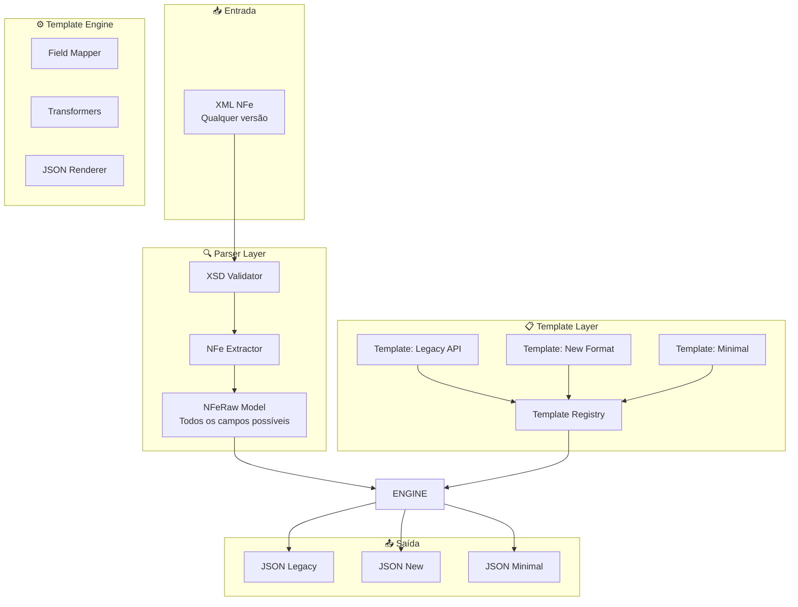
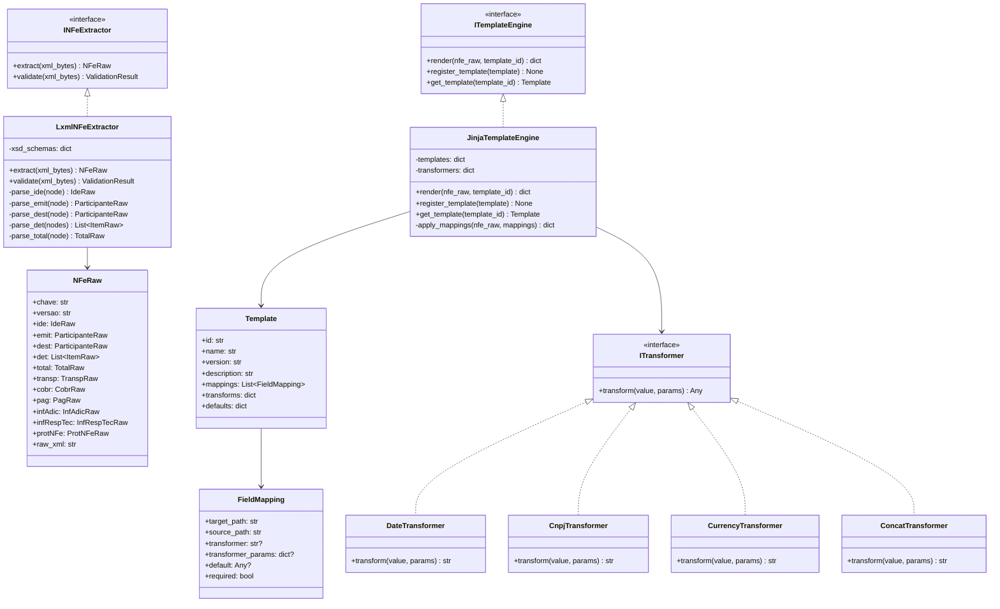
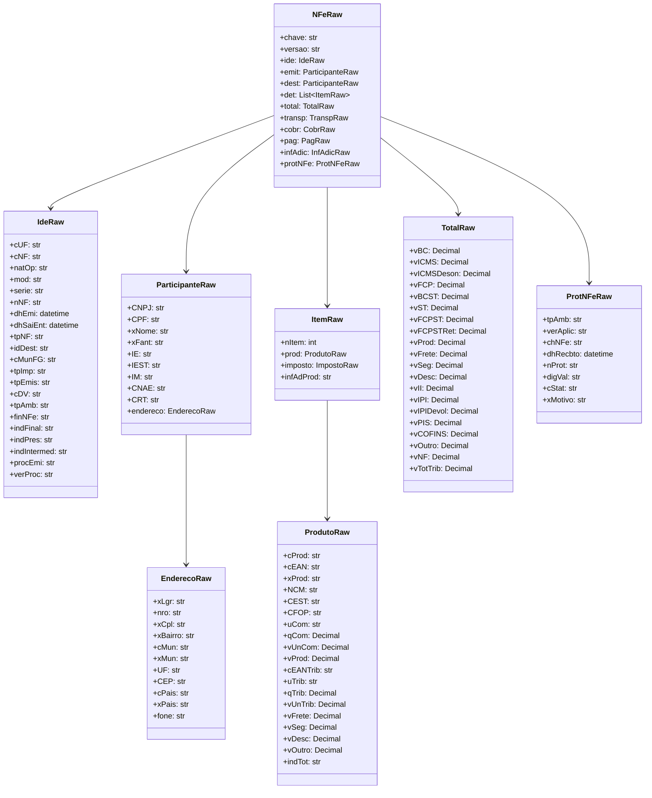
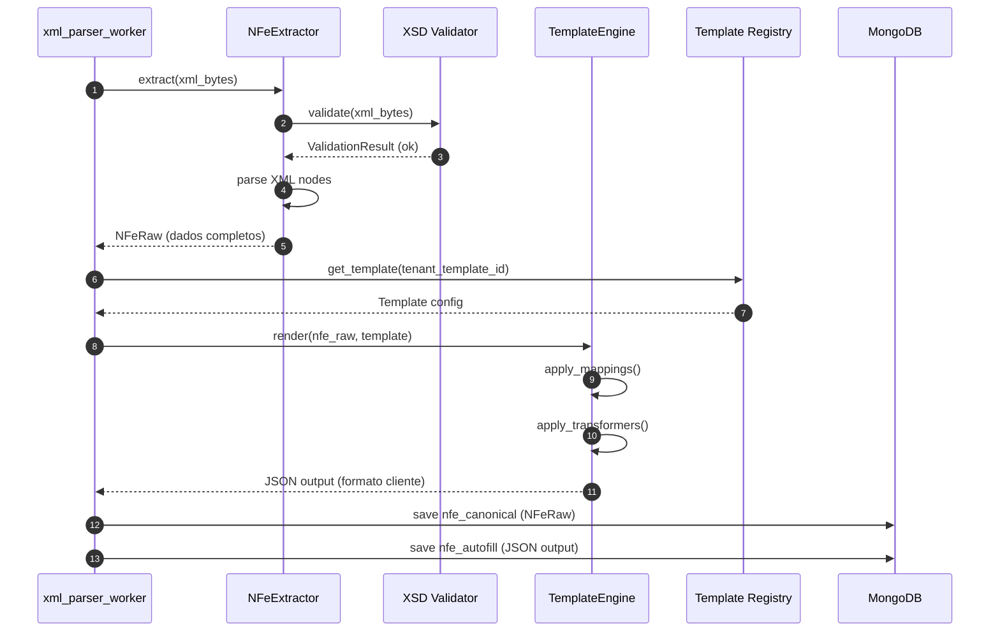
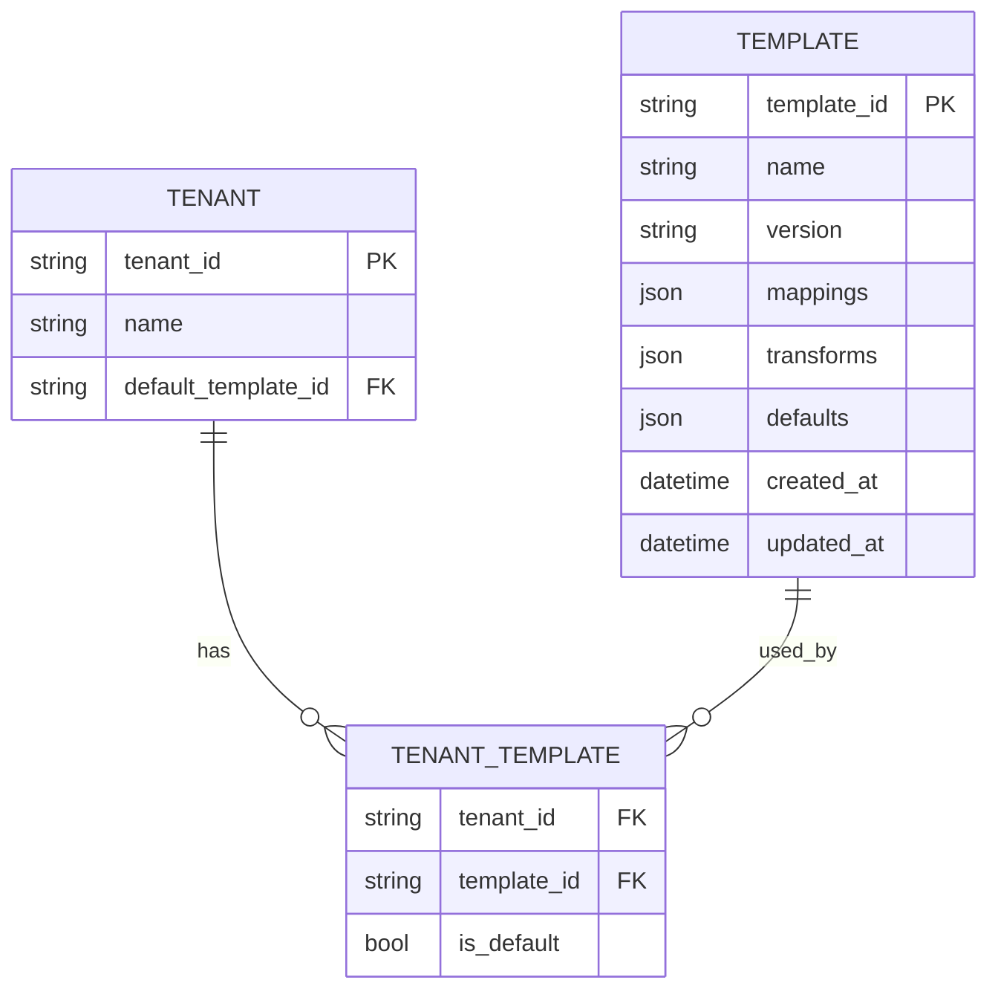

# 🔄 Parser e Sistema de Templates

**Versão:** 1.0  
**Data:** 2026-01-16  
**Status:** Design

---

## 1. Visão Geral

O sistema de parsing é dividido em duas etapas distintas:

1. **Extração** — Extrair dados brutos do XML NFe para um modelo interno completo
2. **Transformação** — Aplicar um Template para gerar o JSON no formato esperado pelo consumidor



---

## 2. Por que Templates?

| Problema | Solução com Templates |
|----------|----------------------|
| Diferentes clientes esperam formatos diferentes | Cada cliente pode ter seu próprio template |
| Formato do fornecedor anterior precisa ser mantido | Template replica o formato exato |
| Novos campos precisam ser adicionados | Edita apenas o template, não o código |
| Campos precisam ser renomeados | Mapeamento no template |
| Transformações de dados (datas, CNPJs) | Funções de transformação no template |

---

## 3. Arquitetura do Parser

### 3.1 Diagrama de Componentes



### 3.2 Diagrama de Classes



---

## 4. Modelo NFeRaw (Extração Completa)

O `NFeRaw` contém **todos os campos possíveis** do XML NFe, servindo como fonte única de dados.



---

## 5. Sistema de Templates

### 5.1 Estrutura de um Template

```yaml
# templates/legacy_api.yaml
id: "legacy_api"
name: "Legacy API Format"
version: "1.0"
description: "Formato compatível com API do fornecedor anterior"

mappings:
  # Campos simples
  - target: "numero_nota"
    source: "ide.nNF"
    
  - target: "serie"
    source: "ide.serie"
    
  - target: "data_emissao"
    source: "ide.dhEmi"
    transformer: "date"
    params:
      format: "%d/%m/%Y"
      
  - target: "chave_acesso"
    source: "chave"
    
  # Emitente
  - target: "emitente.cnpj"
    source: "emit.CNPJ"
    transformer: "cnpj"
    params:
      format: "raw"  # ou "formatted" para XX.XXX.XXX/XXXX-XX
      
  - target: "emitente.razao_social"
    source: "emit.xNome"
    
  - target: "emitente.nome_fantasia"
    source: "emit.xFant"
    default: null
    
  - target: "emitente.inscricao_estadual"
    source: "emit.IE"
    
  - target: "emitente.endereco.logradouro"
    source: "emit.endereco.xLgr"
    
  - target: "emitente.endereco.numero"
    source: "emit.endereco.nro"
    
  - target: "emitente.endereco.cidade"
    source: "emit.endereco.xMun"
    
  - target: "emitente.endereco.uf"
    source: "emit.endereco.UF"
    
  - target: "emitente.endereco.cep"
    source: "emit.endereco.CEP"
    transformer: "cep"
    
  # Destinatário
  - target: "destinatario.cnpj"
    source: "dest.CNPJ"
    transformer: "cnpj"
    
  - target: "destinatario.cpf"
    source: "dest.CPF"
    transformer: "cpf"
    
  - target: "destinatario.razao_social"
    source: "dest.xNome"
    
  # Itens (lista)
  - target: "itens"
    source: "det"
    type: "list"
    item_mappings:
      - target: "numero_item"
        source: "nItem"
        
      - target: "codigo_produto"
        source: "prod.cProd"
        
      - target: "descricao"
        source: "prod.xProd"
        
      - target: "ncm"
        source: "prod.NCM"
        
      - target: "cfop"
        source: "prod.CFOP"
        
      - target: "unidade"
        source: "prod.uCom"
        
      - target: "quantidade"
        source: "prod.qCom"
        transformer: "decimal"
        params:
          precision: 4
          
      - target: "valor_unitario"
        source: "prod.vUnCom"
        transformer: "currency"
        
      - target: "valor_total"
        source: "prod.vProd"
        transformer: "currency"
        
  # Totais
  - target: "totais.valor_produtos"
    source: "total.vProd"
    transformer: "currency"
    
  - target: "totais.valor_frete"
    source: "total.vFrete"
    transformer: "currency"
    
  - target: "totais.valor_desconto"
    source: "total.vDesc"
    transformer: "currency"
    
  - target: "totais.valor_nota"
    source: "total.vNF"
    transformer: "currency"
    
  - target: "totais.base_icms"
    source: "total.vBC"
    transformer: "currency"
    
  - target: "totais.valor_icms"
    source: "total.vICMS"
    transformer: "currency"

# Valores default quando campo não existe no XML
defaults:
  emitente.nome_fantasia: null
  destinatario.cpf: null
```

### 5.2 Exemplo de Output

Dado o template acima, o output seria:

```json
{
  "numero_nota": "123456",
  "serie": "1",
  "data_emissao": "16/01/2026",
  "chave_acesso": "35260112345678000199550010001234561123456789",
  "emitente": {
    "cnpj": "12345678000199",
    "razao_social": "EMPRESA EXEMPLO LTDA",
    "nome_fantasia": "EXEMPLO",
    "inscricao_estadual": "123456789012",
    "endereco": {
      "logradouro": "RUA EXEMPLO",
      "numero": "100",
      "cidade": "SAO PAULO",
      "uf": "SP",
      "cep": "01234567"
    }
  },
  "destinatario": {
    "cnpj": "98765432000188",
    "cpf": null,
    "razao_social": "CLIENTE EXEMPLO S/A"
  },
  "itens": [
    {
      "numero_item": 1,
      "codigo_produto": "PROD001",
      "descricao": "PRODUTO EXEMPLO",
      "ncm": "12345678",
      "cfop": "5102",
      "unidade": "UN",
      "quantidade": 10.0000,
      "valor_unitario": 100.00,
      "valor_total": 1000.00
    }
  ],
  "totais": {
    "valor_produtos": 1000.00,
    "valor_frete": 50.00,
    "valor_desconto": 0.00,
    "valor_nota": 1050.00,
    "base_icms": 1000.00,
    "valor_icms": 180.00
  }
}
```

---

## 6. Transformers Disponíveis

| Transformer | Descrição | Parâmetros |
|-------------|-----------|------------|
| `date` | Formata datetime | `format`: strftime format |
| `cnpj` | Formata CNPJ | `format`: "raw" ou "formatted" |
| `cpf` | Formata CPF | `format`: "raw" ou "formatted" |
| `cep` | Formata CEP | `format`: "raw" ou "formatted" |
| `currency` | Formata valor monetário | `precision`, `locale` |
| `decimal` | Formata decimal | `precision` |
| `uppercase` | Converte para maiúsculas | - |
| `lowercase` | Converte para minúsculas | - |
| `trim` | Remove espaços | - |
| `concat` | Concatena campos | `fields`, `separator` |
| `default` | Valor default se nulo | `value` |
| `map` | Mapeia valores | `mapping`: dict de/para |

---

## 7. Fluxo Completo de Processamento



---

## 8. Configuração por Tenant

Cada tenant pode ter seu próprio template configurado:



---

## 9. Estrutura de Pastas

```
src/nfe_processor/
├── parsers/
│   ├── __init__.py
│   ├── extractor.py          # INFeExtractor interface
│   ├── lxml_extractor.py     # Implementação lxml
│   ├── xsd_validator.py      # Validação XSD
│   └── xsd/                   # Arquivos XSD
│       ├── nfe_v4.00.xsd
│       └── ...
├── templates/
│   ├── __init__.py
│   ├── engine.py             # ITemplateEngine interface
│   ├── jinja_engine.py       # Implementação com Jinja2
│   ├── registry.py           # Template Registry
│   ├── transformers/
│   │   ├── __init__.py
│   │   ├── base.py           # ITransformer interface
│   │   ├── date.py
│   │   ├── document.py       # CNPJ, CPF, CEP
│   │   ├── currency.py
│   │   └── string.py
│   └── definitions/          # Templates YAML
│       ├── legacy_api.yaml
│       ├── minimal.yaml
│       └── full.yaml
├── schemas/
│   ├── __init__.py
│   ├── nfe_raw.py            # NFeRaw e sub-models
│   ├── template.py           # Template, FieldMapping
│   └── ...
```

---

## 10. Próximos Passos

1. **Definir o JSON esperado** — Você precisa me passar o formato que o consumidor atual espera
2. **Criar o primeiro Template** — Baseado no formato existente
3. **Implementar NFeRaw** — Modelo completo de extração
4. **Implementar TemplateEngine** — Motor de transformação
5. **Implementar Transformers** — Funções de conversão

---

## 11. Perguntas Pendentes

Para criar o template correto:

1. **Qual o formato JSON atual?** (exemplo completo)
2. **Há campos calculados?** (ex: total = soma dos itens)
3. **Há campos que vêm de fora do XML?** (ex: ID interno, timestamp de processamento)
4. **Formatos de data/número?** (ex: "DD/MM/YYYY" ou "YYYY-MM-DD", decimal com "." ou ",")
5. **Como são os campos opcionais?** (null, string vazia, ou omitidos?)
