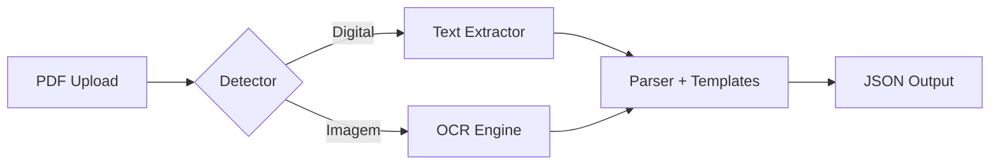
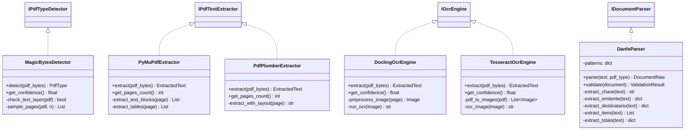
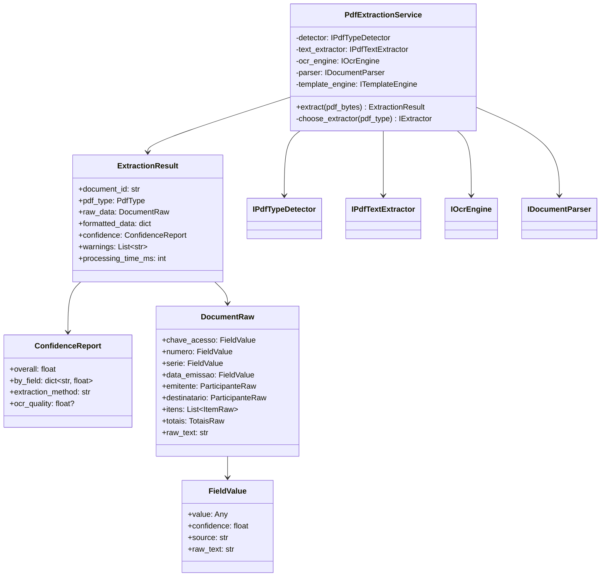
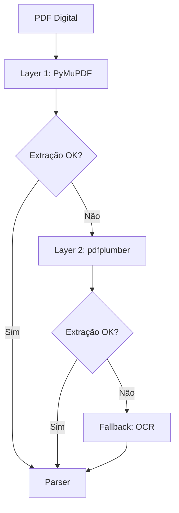
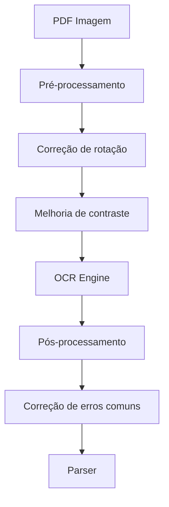
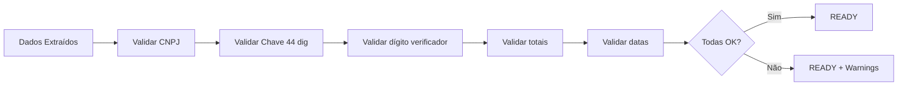
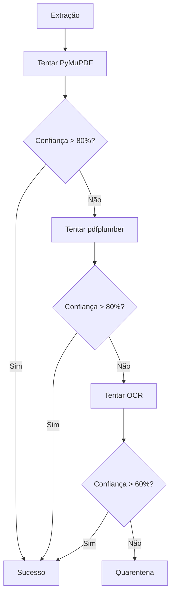

# 📄 Arquitetura de Extração de PDF

**Versão:** 1.0  
**Data:** 2026-01-16  
**Status:** Design

---

## 1. Visão Geral

O sistema recebe **PDFs de documentos fiscais** (DANFEs ou similares) e extrai os dados para um formato JSON estruturado. A extração é feita de forma inteligente, detectando se o PDF é digital (texto selecionável) ou imagem (escaneado).



---

## 2. Tipos de PDF

### 2.1 PDF Digital (Texto Selecionável)

- **Características:** Gerado por software, texto pode ser copiado
- **Extração:** Direta, usando bibliotecas como PyMuPDF ou pdfplumber
- **Confiança:** Alta (95-100%)
- **Velocidade:** Rápida

### 2.2 PDF Imagem (Escaneado)

- **Características:** Documento físico escaneado, texto é imagem
- **Extração:** Requer OCR (Optical Character Recognition)
- **Confiança:** Média (70-95%, depende da qualidade)
- **Velocidade:** Mais lenta

---

## 3. Arquitetura de Componentes

```mermaid
flowchart TB
    subgraph API["📡 API Layer"]
        UPLOAD[POST /documents]
        STATUS[GET /documents/{id}/status]
        RESULT[GET /documents/{id}]
    end

    subgraph Workers["👷 Worker Layer"]
        ROUTER[router_worker]
        PDF_WORKER[pdf_extractor_worker]
        ENRICHER[enricher_worker]
    end

    subgraph Extraction["🔍 Extraction Layer"]
        DETECTOR[PDF Type Detector]
        
        subgraph Digital["PDF Digital"]
            PYMUPDF[PyMuPDF]
            PDFPLUMBER[pdfplumber]
        end
        
        subgraph Image["PDF Imagem"]
            DOCLING[Docling IBM]
            TESSERACT[Tesseract OCR]
        end
        
        PARSER[Document Parser]
    end

    subgraph Templates["📋 Template Layer"]
        ENGINE[Template Engine]
        TRANSFORMER[Transformers]
    end

    subgraph Storage["💾 Storage"]
        MINIO[(MinIO)]
        MONGO[(MongoDB)]
        REDIS[(Redis)]
    end

    UPLOAD --> MINIO
    UPLOAD --> ROUTER
    ROUTER --> PDF_WORKER
    
    PDF_WORKER --> DETECTOR
    DETECTOR --> Digital
    DETECTOR --> Image
    Digital --> PARSER
    Image --> PARSER
    
    PARSER --> ENGINE
    ENGINE --> TRANSFORMER
    TRANSFORMER --> ENRICHER
    
    ENRICHER --> MONGO
    
    STATUS --> REDIS
    RESULT --> MONGO
```

---

## 4. Diagrama de Classes

### 4.1 Interfaces de Extração

```mermaid
classDiagram
    direction TB

    class IPdfTypeDetector {
        <<interface>>
        +detect(pdf_bytes) PdfType
        +get_confidence() float
    }

    class IPdfTextExtractor {
        <<interface>>
        +extract(pdf_bytes) ExtractedText
        +get_pages_count() int
    }

    class IOcrEngine {
        <<interface>>
        +extract(pdf_bytes) ExtractedText
        +get_confidence() float
    }

    class IDocumentParser {
        <<interface>>
        +parse(text, pdf_type) DocumentRaw
        +validate(document) ValidationResult
    }

    class PdfType {
        <<enumeration>>
        DIGITAL
        IMAGE
        MIXED
        UNKNOWN
    }

    class ExtractedText {
        +pages: List~PageText~
        +full_text: str
        +confidence: float
        +metadata: dict
    }

    class PageText {
        +page_number: int
        +text: str
        +blocks: List~TextBlock~
        +tables: List~Table~
    }

    class TextBlock {
        +text: str
        +bbox: BoundingBox
        +confidence: float
    }
```



### 4.2 Implementações



### 4.3 Orquestração



---

## 5. Fluxo de Processamento

```mermaid
sequenceDiagram
    autonumber
    participant C as Cliente
    participant API as API
    participant S3 as MinIO
    participant Q as Redis Queue
    participant W as pdf_extractor_worker
    participant DET as Detector
    participant EXT as Extractor
    participant OCR as OCR Engine
    participant PAR as Parser
    participant TPL as Template Engine
    participant DB as MongoDB

    C->>API: POST /documents (PDF)
    API->>S3: Upload PDF
    API->>DB: Create document (RECEIVED)
    API->>Q: Enqueue job
    API-->>C: 202 { document_id }

    Q->>W: Process job
    W->>S3: Download PDF
    W->>DET: detect(pdf_bytes)
    
    alt PDF Digital
        DET-->>W: DIGITAL
        W->>EXT: extract(pdf_bytes)
        EXT-->>W: ExtractedText
    else PDF Imagem
        DET-->>W: IMAGE
        W->>OCR: extract(pdf_bytes)
        OCR-->>W: ExtractedText
    end

    W->>PAR: parse(text)
    PAR-->>W: DocumentRaw

    W->>TPL: render(raw, template)
    TPL-->>W: JSON formatted

    W->>DB: Save result
    W->>DB: Update status (READY)

    C->>API: GET /documents/{id}
    API->>DB: Get document
    API-->>C: 200 { JSON com dados }
```

---

## 6. Estratégias de Extração

### 6.1 PDF Digital — Estratégia em Camadas



### 6.2 PDF Imagem — Estratégia de OCR



---

## 7. Parser de DANFE

### 7.1 Campos a Extrair

| Campo | Localização típica | Padrão de extração |
|-------|-------------------|-------------------|
| Chave de Acesso | Código de barras / texto | 44 dígitos numéricos |
| Número da Nota | Cabeçalho | `N[º°]?\s*[\d.]+` |
| Série | Cabeçalho | `S[ée]rie\s*:?\s*(\d+)` |
| Data Emissão | Cabeçalho | `\d{2}/\d{2}/\d{4}` |
| CNPJ Emitente | Bloco emitente | `\d{2}\.\d{3}\.\d{3}/\d{4}-\d{2}` |
| Razão Social | Bloco emitente | Texto após CNPJ |
| CNPJ Destinatário | Bloco destinatário | Mesmo padrão |
| Itens | Tabela central | Estrutura tabular |
| Valor Total | Rodapé | `R\$\s*[\d.,]+` ou tabela de totais |

### 7.2 Zonas do DANFE

```
┌─────────────────────────────────────────────────────────┐
│                    ZONA: CABEÇALHO                       │
│  ┌─────────────┐  ┌─────────────────────────────────┐   │
│  │    LOGO     │  │  DANFE - DOCUMENTO AUXILIAR     │   │
│  │  EMITENTE   │  │  Nº 123456  Série 1             │   │
│  └─────────────┘  └─────────────────────────────────┘   │
├─────────────────────────────────────────────────────────┤
│                    ZONA: CHAVE                           │
│  CHAVE DE ACESSO: 3526 0112 3456 7800 0199 ...          │
│  |||||||||||||||||||||||||||||||||||||||||||            │
├─────────────────────────────────────────────────────────┤
│                    ZONA: EMITENTE                        │
│  EMPRESA EXEMPLO LTDA                                    │
│  CNPJ: 12.345.678/0001-99    IE: 123456789              │
├─────────────────────────────────────────────────────────┤
│                    ZONA: DESTINATÁRIO                    │
│  CLIENTE EXEMPLO S/A                                     │
│  CNPJ: 98.765.432/0001-88                               │
├─────────────────────────────────────────────────────────┤
│                    ZONA: ITENS                           │
│  ┌──────┬────────────────┬──────┬────────┬────────┐    │
│  │ Cód  │ Descrição      │ Qtd  │ V.Unit │ V.Total│    │
│  ├──────┼────────────────┼──────┼────────┼────────┤    │
│  │ 001  │ Produto A      │ 10   │ 100,00 │1000,00 │    │
│  └──────┴────────────────┴──────┴────────┴────────┘    │
├─────────────────────────────────────────────────────────┤
│                    ZONA: TOTAIS                          │
│  TOTAL PRODUTOS: R$ 1.000,00    TOTAL NOTA: R$ 1.050,00 │
└─────────────────────────────────────────────────────────┘
```

---

## 8. Confiança e Validação

### 8.1 Níveis de Confiança

| Nível | Score | Significado |
|-------|-------|-------------|
| 🟢 Alta | 95-100% | Extração confiável, pode usar direto |
| 🟡 Média | 80-94% | Revisar campos críticos |
| 🟠 Baixa | 60-79% | Requer revisão manual |
| 🔴 Muito Baixa | <60% | Extração falhou, quarentena |

### 8.2 Validações Aplicadas



### 8.3 Cálculo de Confiança

```python
def calculate_confidence(extraction_result):
    weights = {
        'chave_acesso': 0.25,      # Crítico
        'cnpj_emitente': 0.15,     # Crítico
        'cnpj_destinatario': 0.15, # Crítico
        'valor_total': 0.15,       # Importante
        'numero_nota': 0.10,       # Importante
        'data_emissao': 0.10,      # Importante
        'itens': 0.10,             # Complementar
    }
    
    total = sum(
        field.confidence * weight 
        for field, weight in weights.items()
    )
    return total
```

---

## 9. Tratamento de Erros

### 9.1 Erros Comuns de OCR

| Erro | Exemplo | Correção |
|------|---------|----------|
| 0 ↔ O | `CN0J` | Contexto: CNPJ só tem números |
| 1 ↔ l ↔ I | `l2345` | Contexto numérico |
| 5 ↔ S | `1234S` | Validação de dígito |
| 8 ↔ B | `123B5` | Contexto numérico |
| Espaços | `12 345 678` | Remove espaços em campos numéricos |

### 9.2 Fallback Strategy



---

## 10. Stack de Bibliotecas

| Componente | Biblioteca | Uso |
|------------|------------|-----|
| Detecção | PyMuPDF (fitz) | Detectar se tem texto |
| Extração Digital | PyMuPDF + pdfplumber | Extrair texto e tabelas |
| OCR Primário | Docling (IBM) | OCR avançado com layout |
| OCR Fallback | Tesseract + pdf2image | OCR básico |
| Pré-processamento | Pillow, OpenCV | Melhorar imagem para OCR |
| Validação | python-stdnum | Validar CNPJ, CPF |

---

## 11. Configuração de Ambiente

### 11.1 Dependências

```toml
# pyproject.toml
[project]
dependencies = [
    "pymupdf>=1.23.0",
    "pdfplumber>=0.10.0",
    "docling>=1.0.0",
    "pytesseract>=0.3.10",
    "pdf2image>=1.16.0",
    "pillow>=10.0.0",
    "python-stdnum>=1.19",
]
```

### 11.2 Docker (Tesseract)

```dockerfile
# Se usar Tesseract
RUN apt-get update && apt-get install -y \
    tesseract-ocr \
    tesseract-ocr-por \
    poppler-utils
```

---

## 12. Métricas e Monitoramento

| Métrica | Tipo | Descrição |
|---------|------|-----------|
| `pdf_processed_total` | Counter | Total de PDFs processados |
| `pdf_type_detected` | Counter | Por tipo (digital/image) |
| `extraction_confidence` | Histogram | Distribuição de confiança |
| `extraction_duration_seconds` | Histogram | Tempo de extração |
| `ocr_errors_total` | Counter | Erros de OCR |
| `quarantine_total` | Counter | Documentos em quarentena |
